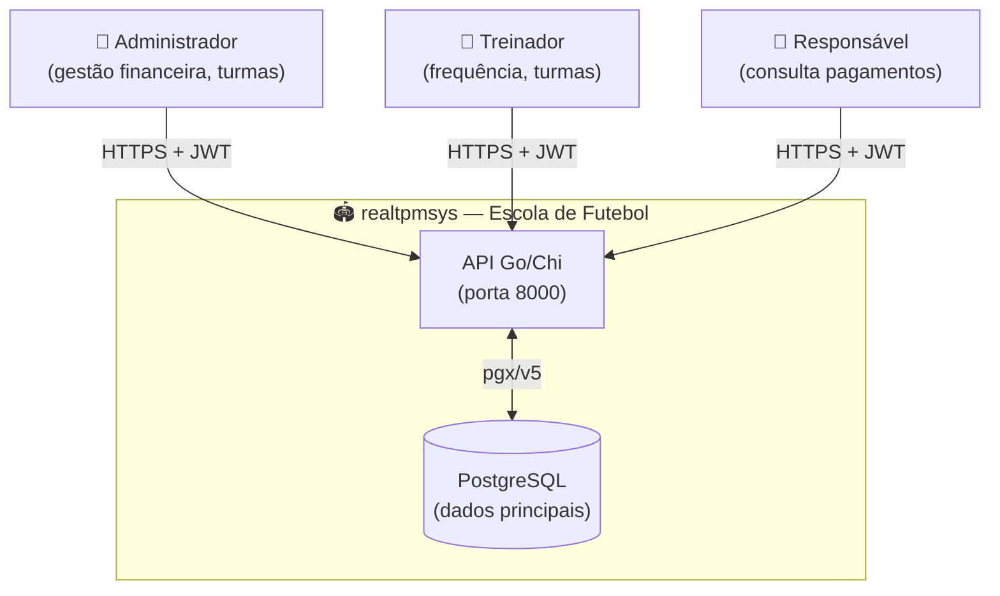
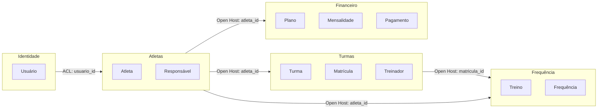
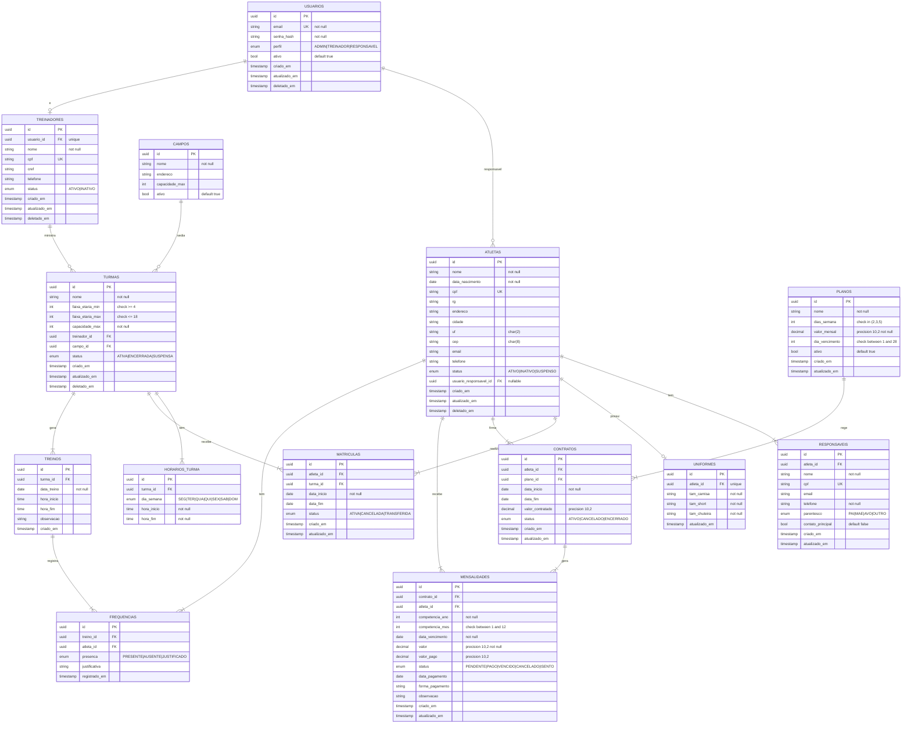

# SDD — realtpmsys: Sistema de Gerenciamento de Escola de Futebol

**Versão:** 2.0.0  
**Data:** 2026-04-15  
**Arquiteto:** dev-arquiteto  
**Status:** Aprovado para implementação — Stack migrada para Go

---

## 1. Visão Geral da Arquitetura

### 1.1 Contexto do Sistema (C4 Level 1)



### 1.2 Bounded Contexts (DDD)

O sistema é dividido em **5 contextos delimitados**:

| Contexto | Responsabilidade | Tipo |
|---|---|---|
| **Identidade** | Autenticação e perfis de usuário | Supporting |
| **Atletas** | Cadastro, responsáveis, uniformes | Core |
| **Turmas** | Horários, campos, treinadores, matrículas | Core |
| **Frequência** | Presenças por treino, relatórios | Core |
| **Financeiro** | Planos, mensalidades, pagamentos, inadimplência | Core |

#### Mapa de Contextos



**Padrões de integração entre contextos:**
- **ACL (Anti-Corruption Layer):** Identidade → Atletas. O contexto de Atletas não conhece o modelo de `User` — recebe apenas `usuario_id` e valida via token JWT.
- **Open Host Service:** Atletas expõe `AtletaId` como tipo publicado para Turmas e Financeiro.
- **Shared Kernel:** `AuditFields` (criado_em, atualizado_em, deletado_em) compartilhado entre todos os contextos.

### 1.3 Padrão Arquitetural: Clean Architecture

```
┌──────────────────────────────────────────────────────────────────┐
│  Frameworks & Drivers                                            │
│  Chi routers · Go structs · pgx/v5 · golang-migrate · sqlc       │
├──────────────────────────────────────────────────────────────────┤
│  Interface Adapters                                              │
│  HTTP Controllers · Repository Implementations · Presenters      │
├──────────────────────────────────────────────────────────────────┤
│  Application Layer                                               │
│  Use Cases · Commands · Queries · DTOs                           │
├──────────────────────────────────────────────────────────────────┤
│  Domain Layer                                                    │
│  Entities · Value Objects · Repository Interfaces · Events       │
└──────────────────────────────────────────────────────────────────┘
```

**Regra de dependência:** cada camada só conhece a camada imediatamente interior. O domínio não importa nada externo.

### 1.4 ADRs (Architecture Decision Records)

#### ADR-001 — Go em vez de Python *(revisado em 2026-04-15)*

**Decisão:** Usar Go 1.22 + Chi.  
**Razão:** O ambiente de produção opera com restrições de capacity (RAM/CPU). Go entrega ~5–8× menos consumo de memória por instância, binário estático sem runtime (~20 MB vs ~300 MB), startup < 100 ms e type safety em compile-time — eliminando uma categoria inteira de bugs em operações financeiras. A equipe possui experiência em Go, removendo o risco de curva de aprendizado.  
**Trade-off:** Geração de relatórios em PDF/Excel é mais limitada em Go. Se esse módulo crescer, isolar em microserviço Python separado consumindo a mesma API.

#### ADR-002 — PostgreSQL como banco principal
**Decisão:** Migrar de SQLite para PostgreSQL.  
**Razão:** Suporte a UUID nativo, enums, JSONB, transações ACID para operações financeiras, e `pg_cron` para geração automática de mensalidades.  
**Trade-off:** Maior complexidade operacional que SQLite, mas necessário para concorrência e integridade financeira.

#### ADR-003 — Mensalidades geradas por aplicação, não por trigger

**Decisão:** Geração de mensalidades via job agendado na aplicação (`robfig/cron`), não via triggers do banco.  
**Razão:** Lógica de negócio deve ficar na camada de domínio, não no banco. Facilita testes e debugging.

#### ADR-004 — Soft delete em todas as entidades
**Decisão:** Nenhuma entidade é deletada fisicamente — campo `deletado_em` controla exclusão lógica.  
**Razão:** Auditoria financeira exige histórico completo. Atleta inativo ainda deve ter mensalidades visíveis.

---

## 2. Esquema do Banco de Dados

### 2.1 Diagrama ERD



### 2.2 Decisões de Modelagem

| Decisão | Justificativa |
|---|---|
| UUID como PK em todas as tabelas | Suporta sharding futuro; evita enumeração de IDs na API |
| `competencia_ano` + `competencia_mes` separados em Mensalidades | Facilita queries de inadimplência por período sem manipulação de datas |
| `valor_contratado` no Contrato | Preço pode mudar no Plano; contrato registra o valor acordado no momento |
| Tabela `Treinos` separada de `Horarios_Turma` | Treino é uma ocorrência real (com data); horário é a definição recorrente |
| `Uniformes` com relação 1:1 via tabela separada | Evita colunas nulas em Atletas; facilita histórico de trocas de tamanho |

---

## 3. Definição de Endpoints / Interfaces

> Contrato completo em `docs/openapi.yaml`. Resumo dos grupos de recursos:

### 3.1 Tabela de Endpoints

| Método | Path | Autenticação | Descrição |
|---|---|---|---|
| POST | `/auth/login` | Público | Gera JWT |
| POST | `/auth/refresh` | Bearer | Renova token |
| GET | `/atletas` | ADMIN, TREINADOR | Lista atletas (paginado, filtros) |
| POST | `/atletas` | ADMIN | Cadastra atleta |
| GET | `/atletas/{id}` | ADMIN, TREINADOR | Detalhe do atleta |
| PUT | `/atletas/{id}` | ADMIN | Atualiza atleta |
| DELETE | `/atletas/{id}` | ADMIN | Soft delete |
| POST | `/atletas/{id}/responsaveis` | ADMIN | Adiciona responsável |
| GET | `/turmas` | ADMIN, TREINADOR | Lista turmas |
| POST | `/turmas` | ADMIN | Cria turma |
| POST | `/turmas/{id}/matriculas` | ADMIN | Matricula atleta |
| GET | `/turmas/{id}/matriculas` | ADMIN, TREINADOR | Lista matrículas |
| POST | `/treinos` | TREINADOR, ADMIN | Registra treino |
| POST | `/treinos/{id}/frequencias` | TREINADOR, ADMIN | Lança presenças em lote |
| GET | `/treinos/{id}/frequencias` | ADMIN, TREINADOR | Consulta frequências |
| GET | `/planos` | ADMIN | Lista planos |
| POST | `/planos` | ADMIN | Cria plano |
| POST | `/contratos` | ADMIN | Firma contrato atleta/plano |
| GET | `/mensalidades` | ADMIN | Lista mensalidades (filtros: status, mes, atleta) |
| GET | `/mensalidades/{id}` | ADMIN, RESPONSAVEL | Detalhe mensalidade |
| PATCH | `/mensalidades/{id}/pagar` | ADMIN | Registra pagamento |
| PATCH | `/mensalidades/{id}/cancelar` | ADMIN | Cancela mensalidade |
| POST | `/mensalidades/gerar` | ADMIN | Gera mensalidades do mês |
| GET | `/relatorios/inadimplencia` | ADMIN | Relatório de inadimplência |
| GET | `/relatorios/frequencia/{atleta_id}` | ADMIN, TREINADOR | Frequência por atleta |
| GET | `/relatorios/frequencia/turma/{turma_id}` | ADMIN, TREINADOR | Frequência por turma |

### 3.2 Padrão de Erros

Todos os erros seguem o formato RFC 7807 (Problem Details):

```json
{
  "type": "https://realtpmsys.local/errors/validation-error",
  "title": "Dados inválidos",
  "status": 422,
  "detail": "O campo 'data_nascimento' é obrigatório",
  "instance": "/atletas",
  "errors": [
    {"field": "data_nascimento", "message": "campo obrigatório"}
  ]
}
```

### 3.3 Paginação Padrão

Todos os endpoints de listagem seguem o padrão cursor-based ou offset:

```json
{
  "data": [...],
  "pagination": {
    "total": 150,
    "page": 1,
    "per_page": 20,
    "pages": 8
  }
}
```

---

## 4. Stack Tecnológica

### 4.1 Stack Adotada: Go 1.22

| Componente | Tecnologia | Justificativa |
|---|---|---|
| API Principal | Go 1.22 + Chi v5 | Binário estático ~20 MB, goroutines nativas, type safety em compile-time |
| Queries SQL | sqlc + pgx/v5 | Queries type-safe geradas a partir do SQL — zero ORM overhead |
| Migrations | golang-migrate v4 | Par up/down versionado, integrado ao Makefile |
| Autenticação | golang-jwt/jwt v5 + bcrypt | Stdlib-friendly, sem reflexão pesada |
| Job Scheduler | robfig/cron v3 | Expressões cron POSIX, goroutine por job |
| Testes | testing + testify + build tags | Table-driven tests, testes de integração isolados por build tag |
| Observabilidade | OpenTelemetry Go SDK + Prometheus | Padrão de mercado, instrumentação automática Chi/pgx |
| Banco | PostgreSQL 16 | Enums, UUID, transações ACID para financeiro |

**Vantagens concretas de Go neste contexto:**

- Binário único sem runtime — deploy é `COPY` no Dockerfile, imagem final < 25 MB.
- ~15–30 MB de RAM baseline vs ~90–150 MB por worker Python — crítico em ambiente com capacity restrito.
- Interfaces implícitas tornam Ports & Adapters idiomático: `var _ domain.Repo = (*PgxRepo)(nil)` garante contrato em compile-time.
- `sqlc` elimina N+1 silenciosos e erros de tipo em queries — o compilador rejeita discrepâncias entre SQL e struct.

### 4.2 Estrutura de Pastas — Clean Architecture

```text
realtpmsys/
├── cmd/
│   └── api/
│       └── main.go                      # entry point, DI wiring, graceful shutdown
│
├── internal/
│   ├── domain/                          # Camada de Domínio (zero dependências externas)
│   │   ├── atleta/
│   │   │   ├── entity.go                # Atleta, Responsavel, Uniforme + regras de negócio
│   │   │   └── repository.go            # interface Repository (Port)
│   │   ├── turma/
│   │   │   ├── entity.go                # Turma, Matricula, Treino, HorarioTurma
│   │   │   └── repository.go
│   │   ├── financeiro/
│   │   │   ├── entity.go                # Plano, Contrato, Mensalidade + máquina de estados
│   │   │   ├── repository.go            # interfaces PlanoRepository, ContratoRepository, MensalidadeRepository
│   │   │   └── service.go               # GeradorMensalidadeService (lógica pura, sem I/O)
│   │   ├── frequencia/
│   │   │   ├── entity.go                # Frequencia
│   │   │   └── repository.go
│   │   └── shared/
│   │       └── errors.go                # erros sentinela + DomainError
│   │
│   ├── application/                     # Casos de Uso (orquestra domínio + ports)
│   │   ├── atleta/
│   │   │   └── use_cases.go             # CadastrarAtletaUseCase, InativarAtletaUseCase
│   │   ├── turma/
│   │   │   └── use_cases.go             # CriarTurmaUseCase, MatricularAtletaUseCase
│   │   ├── financeiro/
│   │   │   └── use_cases.go             # FirmarContratoUseCase, GerarMensalidadesUseCase, RegistrarPagamentoUseCase
│   │   └── frequencia/
│   │       └── use_cases.go             # LancarFrequenciaUseCase
│   │
│   ├── infrastructure/                  # Adapters (Chi, pgx, cron)
│   │   ├── persistence/
│   │   │   ├── sqlc/                    # Código Go gerado pelo sqlc (nunca editar)
│   │   │   │   ├── db.go
│   │   │   │   ├── models.go
│   │   │   │   └── *.sql.go
│   │   │   ├── sqlc/queries/            # SQL fonte para o sqlc
│   │   │   │   ├── atleta.sql
│   │   │   │   ├── mensalidade.sql
│   │   │   │   └── contrato.sql
│   │   │   └── repository/              # Implementações concretas dos Ports
│   │   │       ├── atleta_repository.go
│   │   │       ├── mensalidade_repository.go
│   │   │       ├── contrato_repository.go
│   │   │       └── frequencia_repository.go
│   │   ├── http/
│   │   │   ├── router.go                # Chi router, middlewares globais, registro de rotas
│   │   │   ├── handler/
│   │   │   │   ├── atleta_handler.go
│   │   │   │   ├── mensalidade_handler.go
│   │   │   │   ├── turma_handler.go
│   │   │   │   └── relatorio_handler.go
│   │   │   ├── middleware/
│   │   │   │   └── auth.go              # JWT validation, RequirePerfil
│   │   │   └── response/
│   │   │       └── problem.go           # RFC 7807 — mapeamento domínio → HTTP
│   │   └── jobs/
│   │       └── mensalidade_job.go       # robfig/cron: gerar mensalidades dia 1, marcar vencidas
│   │
│   └── config/
│       └── config.go                    # leitura e validação de variáveis de ambiente
│
├── migrations/                          # golang-migrate: pares up/down versionados
│   ├── 000001_initial_schema.up.sql
│   └── 000001_initial_schema.down.sql
│
├── docs/
│   ├── SDD.md                           # Este documento
│   ├── schema.sql                       # Schema PostgreSQL canônico
│   ├── openapi.yaml                     # Contrato de API (inalterado)
│   └── persistence-guide.md            # Guia para dev-expert-fullcycle
│
├── sqlc.yaml                            # Configuração do gerador sqlc
├── Makefile                             # run, build, test, lint, sqlc, migrate-*
├── go.mod
├── .env.example
└── README.md
```

---

## 5. Estratégias de Resiliência e Observabilidade

### 5.1 Operações Críticas e Resiliência

#### Registro de Pagamento (operação financeira — alta criticidade)
- **Transação atômica:** UPDATE mensalidade + INSERT pagamento em uma única transação PostgreSQL.
- **Idempotência:** `mensalidade_id` como chave de idempotência — duplo clique não registra dois pagamentos.
- **Retry:** Não aplica retry em erros de negócio (mensalidade já paga = 409). Aplica retry com backoff em falhas de conexão ao BD (3 tentativas, backoff: 0.5s, 1s, 2s).

#### Geração de Mensalidades (job mensal)
- **Idempotência:** Unique constraint em `(contrato_id, competencia_ano, competencia_mes)` — re-execução do job não duplica mensalidades.
- **Dead Letter:** Falhas no job são registradas em tabela `job_erros` com payload para reprocessamento manual.

### 5.2 Observabilidade — Three Pillars

#### Logs (JSON estruturado)
```json
{
  "timestamp": "2026-04-14T10:30:00Z",
  "level": "INFO",
  "service": "realtpmsys",
  "trace_id": "abc123",
  "span_id": "def456",
  "event": "pagamento_registrado",
  "atleta_id": "uuid...",
  "mensalidade_id": "uuid...",
  "valor": 150.00
}
```

#### Métricas RED por endpoint
| Endpoint | Rate | Errors | Duration SLO |
|---|---|---|---|
| POST /auth/login | req/s | 4xx/5xx | p99 < 200ms |
| POST /atletas | req/s | 4xx/5xx | p99 < 300ms |
| POST /mensalidades/{id}/pagar | req/s | 4xx/5xx | p99 < 500ms |
| GET /relatorios/inadimplencia | req/s | 5xx | p99 < 2s |

#### Tracing

- OpenTelemetry Go SDK com propagação W3C TraceContext.
- Instrumentação automática: Chi (HTTP), pgx (queries), robfig/cron (jobs).
- Backend: Jaeger (desenvolvimento) / Tempo (produção).

### 5.3 SLO / SLA

| Indicador (SLI) | Objetivo (SLO) | Acordo (SLA) |
|---|---|---|
| Disponibilidade da API | 99.5% em 30 dias | 99% mensal |
| Latência p99 endpoints críticos | < 500ms | — |
| Geração de mensalidades no prazo | 100% até dia 1 de cada mês | — |
| Tempo de resposta relatórios | p95 < 3s | — |

---

## 6. Riscos e Decisões Pendentes

### Riscos Identificados

| Risco | Probabilidade | Impacto | Mitigação |
|---|---|---|---|
| Migração de dados do SQLite existente | Alta | Médio | Script de migração em `alembic/versions/0002_migrate_sqlite.py` |
| Conflito de mensalidade em re-geração | Média | Alto | Unique constraint + idempotência no use case |
| Acesso de responsável a dados de outros atletas | Baixa | Alto | RLS (Row Level Security) no PostgreSQL por `usuario_id` |
| Crescimento de tabela `frequencias` (> 1M rows) | Média | Médio | Particionamento por ano em PostgreSQL 16 |

### Decisões Pendentes (requerem validação com stakeholders)

1. **Multi-unidade:** O sistema deve suportar múltiplas unidades da escola? Se sim, adicionar `unidade_id` como tenant isolado.
2. **Portal do responsável:** Responsável acessa via mesmo sistema ou app separado?
3. **Integração de pagamento:** Gateway de pagamento externo (Stripe, PagSeguro) ou somente registro manual?
4. **Notificações:** Envio de boleto/Pix automático ao gerar mensalidade?

### Premissas Assumidas

- Escola de médio porte: até 500 atletas simultâneos.
- Operação em única unidade (sem multi-tenancy neste sprint).
- Pagamentos registrados manualmente pelo administrador.
- Não há integração com gateway de pagamento externo nesta versão.
