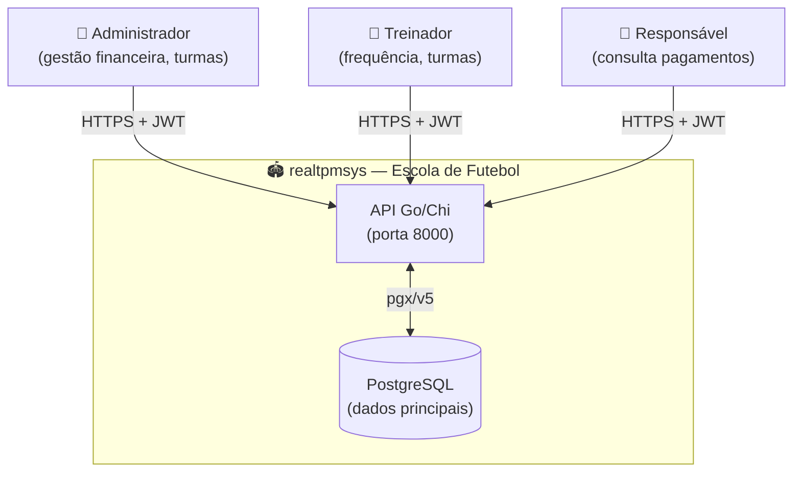
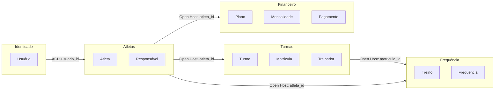
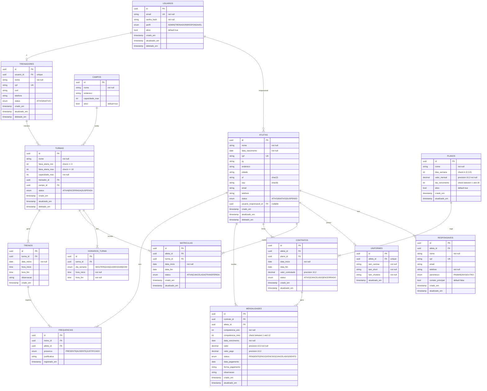

# SDD — realtpmsys: Sistema de Gerenciamento de Escola de Futebol

**Versão:** 2.1.0
**Data:** 2026-05-19
**Arquiteto:** dev-arquiteto
**Status:** MVP em produção lab — Go 1.24, deploy via ArgoCD + Tekton + Harbor

> **Mudanças vs v2.0.0 (2026-04-15):**
>
> - Stack Go: 1.22 → 1.24 (golang-migrate 4.19+ exige Go 1.24)
> - Adicionados ADR-005 (migrations no startup), ADR-006 (MetalLB sem Ingress),
>   ADR-007 (Tekton + Kaniko para build in-cluster)
> - Bounded contexts: Treinador e Campo promovidos a domínios próprios
>   (antes eram tabelas avulsas referenciadas por Turma)

---

## 1. Visão Geral da Arquitetura

### 1.1 Contexto do Sistema (C4 Level 1)


```mermaid
flowchart TD
    Admin["👤 Administrador\n(gestão financeira, turmas)"]
    Treinador["👤 Treinador\n(frequência, turmas)"]
    Responsavel["👤 Responsável\n(consulta pagamentos)"]

    subgraph realtpmsys["🏟️ realtpmsys — Escola de Futebol"]
        API["API Go/Chi\n(porta 8000)"]
        DB[("PostgreSQL\n(dados principais)")]
    end

    Admin -->|HTTPS + JWT| API
    Treinador -->|HTTPS + JWT| API
    Responsavel -->|HTTPS + JWT| API
    API <-->|pgx/v5| DB
```

### 1.2 Bounded Contexts (DDD)

O sistema é dividido em **5 contextos delimitados**:

| Contexto | Responsabilidade | Tipo |
|---|---|---|
| **Identidade** | Autenticação e perfis de usuário | Supporting |
| **Atletas** | Cadastro, responsáveis, uniformes | Core |
| **Turmas** | Horários, campos, treinadores, matrículas | Core |
| **Frequência** | Presenças por treino, relatórios | Core |
| **Financeiro** | Planos, mensalidades, pagamentos, inadimplência | Core |

#### Mapa de Contextos


```mermaid
flowchart LR
    subgraph Identidade
        U[Usuário]
    end
    subgraph Atletas
        A[Atleta]
        R[Responsável]
    end
    subgraph Turmas
        T[Turma]
        M[Matrícula]
        TR[Treinador]
    end
    subgraph Frequencia["Frequência"]
        TRN[Treino]
        F[Frequência]
    end
    subgraph Financeiro
        PL[Plano]
        MN[Mensalidade]
        PG[Pagamento]
    end

    Identidade -->|ACL: usuario_id| Atletas
    Atletas -->|Open Host: atleta_id| Turmas
    Atletas -->|Open Host: atleta_id| Financeiro
    Turmas -->|Open Host: matricula_id| Frequencia
    Atletas -->|Open Host: atleta_id| Frequencia
```

**Padrões de integração entre contextos:**
- **ACL (Anti-Corruption Layer):** Identidade → Atletas. O contexto de Atletas não conhece o modelo de `User` — recebe apenas `usuario_id` e valida via token JWT.
- **Open Host Service:** Atletas expõe `AtletaId` como tipo publicado para Turmas e Financeiro.
- **Shared Kernel:** `AuditFields` (criado_em, atualizado_em, deletado_em) compartilhado entre todos os contextos.

### 1.3 Padrão Arquitetural: Clean Architecture

```
┌──────────────────────────────────────────────────────────────────┐
│  Frameworks & Drivers                                            │
│  Chi routers · Go structs · pgx/v5 · golang-migrate · sqlc       │
├──────────────────────────────────────────────────────────────────┤
│  Interface Adapters                                              │
│  HTTP Controllers · Repository Implementations · Presenters      │
├──────────────────────────────────────────────────────────────────┤
│  Application Layer                                               │
│  Use Cases · Commands · Queries · DTOs                           │
├──────────────────────────────────────────────────────────────────┤
│  Domain Layer                                                    │
│  Entities · Value Objects · Repository Interfaces · Events       │
└──────────────────────────────────────────────────────────────────┘
```

**Regra de dependência:** cada camada só conhece a camada imediatamente interior. O domínio não importa nada externo.

### 1.4 ADRs (Architecture Decision Records)

#### ADR-001 — Go em vez de Python *(revisado em 2026-04-15)*

**Decisão:** Usar Go 1.22 + Chi.  
**Razão:** O ambiente de produção opera com restrições de capacity (RAM/CPU). Go entrega ~5–8× menos consumo de memória por instância, binário estático sem runtime (~20 MB vs ~300 MB), startup < 100 ms e type safety em compile-time — eliminando uma categoria inteira de bugs em operações financeiras. A equipe possui experiência em Go, removendo o risco de curva de aprendizado.  
**Trade-off:** Geração de relatórios em PDF/Excel é mais limitada em Go. Se esse módulo crescer, isolar em microserviço Python separado consumindo a mesma API.

#### ADR-002 — PostgreSQL como banco principal
**Decisão:** Migrar de SQLite para PostgreSQL.  
**Razão:** Suporte a UUID nativo, enums, JSONB, transações ACID para operações financeiras, e `pg_cron` para geração automática de mensalidades.  
**Trade-off:** Maior complexidade operacional que SQLite, mas necessário para concorrência e integridade financeira.

#### ADR-003 — Mensalidades geradas por aplicação, não por trigger

**Decisão:** Geração de mensalidades via job agendado na aplicação (`robfig/cron`), não via triggers do banco.  
**Razão:** Lógica de negócio deve ficar na camada de domínio, não no banco. Facilita testes e debugging.

#### ADR-004 — Soft delete em todas as entidades

**Decisão:** Nenhuma entidade é deletada fisicamente — campo `deletado_em` controla exclusão lógica.
**Razão:** Auditoria financeira exige histórico completo. Atleta inativo ainda deve ter mensalidades visíveis.
**Exceção:** `campos` usa flag `ativo` boolean (sem soft delete) — não tem dependência financeira.

#### ADR-005 — Migrations aplicadas no startup do binário *(adicionado em 2026-05-18)*

**Decisão:** O binário aplica as migrations pendentes via `golang-migrate` (lib) antes de abrir o pool pgx, controlado por `APP_RUN_MIGRATIONS=true` (default).
**Razão:** Elimina a necessidade de Job/initContainer separado de migration no K8s. Atomicidade: o pod só fica `Ready` quando schema está alinhado com o código. Idempotente — `migrate.ErrNoChange` é silenciado.
**Trade-off:** Em rollout com múltiplas réplicas, todas tentam aplicar; o `migrate` usa advisory lock do PG para serializar. Para migrations pesadas (>1min) seria melhor um Job separado — mas neste MVP migrations são leves (schema único + admin password).

#### ADR-006 — MetalLB LoadBalancer ao invés de Ingress *(adicionado em 2026-05-18)*

**Decisão:** Service tipo `LoadBalancer` com `loadBalancerIP` fixo no pool MetalLB (192.168.1.208), ao invés de Ingress + Controller (NGINX/Traefik dedicado).
**Razão:** O lab K3s não tem Ingress Controller próprio (Traefik default do K3s desabilitado). MetalLB é mais simples para um único serviço HTTP por app. DNS resolvido via Pi-hole (`api.realtpmsys.local → 192.168.1.208`).
**Trade-off:** Não há terminação TLS no LB — em prod usar Ingress + cert-manager. Cada novo app consome um IP MetalLB do pool.

#### ADR-007 — CI/CD via Tekton + Kaniko in-cluster *(adicionado em 2026-05-19)*

**Decisão:** Pipeline Tekton no namespace `cicd` builda a imagem com Kaniko (sem Docker daemon) a partir do clone Gitea, publica em Harbor (`harbor.lab.local`) com tag dupla `:latest` + `:sha-<7chars>`.
**Razão:** Kaniko roda 100% in-cluster — sem necessidade de Docker daemon, sem GitHub Actions externo, sem expor secrets do registry para CI externo. Tekton já estava instalado no lab. Tag `sha-<7chars>` é imutável e permite rollback.
**Trade-off:** Mirror PULL do Gitea (do GitHub) não dispara webhook nativamente — webhook só funciona em push direto ao Gitea. Workaround atual: invocar EventListener via curl após `mirror-sync` ou disparar PipelineRun manual via `kubectl create`. Para automação completa, ou migrar para Gitea-primary (push reverso pro GitHub) ou rodar CronJob de polling.

---

## 2. Esquema do Banco de Dados

### 2.1 Diagrama ERD


```mermaid
erDiagram
    USUARIOS {
        uuid id PK
        string email UK "not null"
        string senha_hash "not null"
        enum perfil "ADMIN|TREINADOR|RESPONSAVEL"
        bool ativo "default true"
        timestamp criado_em
        timestamp atualizado_em
        timestamp deletado_em
    }

    ATLETAS {
        uuid id PK
        string nome "not null"
        date data_nascimento "not null"
        string cpf UK
        string rg
        string endereco
        string cidade
        string uf "char(2)"
        string cep "char(8)"
        string email
        string telefone
        enum status "ATIVO|INATIVO|SUSPENSO"
        uuid usuario_responsavel_id FK "nullable"
        timestamp criado_em
        timestamp atualizado_em
        timestamp deletado_em
    }

    RESPONSAVEIS {
        uuid id PK
        uuid atleta_id FK
        string nome "not null"
        string cpf UK
        string email
        string telefone "not null"
        enum parentesco "PAI|MAE|AVO|OUTRO"
        bool contato_principal "default false"
        timestamp criado_em
        timestamp atualizado_em
    }

    UNIFORMES {
        uuid id PK
        uuid atleta_id FK "unique"
        string tam_camisa "not null"
        string tam_short "not null"
        string tam_chuteira "not null"
        timestamp atualizado_em
    }

    TREINADORES {
        uuid id PK
        uuid usuario_id FK "unique"
        string nome "not null"
        string cpf UK
        string cref
        string telefone
        enum status "ATIVO|INATIVO"
        timestamp criado_em
        timestamp atualizado_em
        timestamp deletado_em
    }

    CAMPOS {
        uuid id PK
        string nome "not null"
        string endereco
        int capacidade_max
        bool ativo "default true"
    }

    TURMAS {
        uuid id PK
        string nome "not null"
        int faixa_etaria_min "check >= 4"
        int faixa_etaria_max "check <= 18"
        int capacidade_max "not null"
        uuid treinador_id FK
        uuid campo_id FK
        enum status "ATIVA|ENCERRADA|SUSPENSA"
        timestamp criado_em
        timestamp atualizado_em
        timestamp deletado_em
    }

    HORARIOS_TURMA {
        uuid id PK
        uuid turma_id FK
        enum dia_semana "SEG|TER|QUA|QUI|SEX|SAB|DOM"
        time hora_inicio "not null"
        time hora_fim "not null"
    }

    MATRICULAS {
        uuid id PK
        uuid atleta_id FK
        uuid turma_id FK
        date data_inicio "not null"
        date data_fim
        enum status "ATIVA|CANCELADA|TRANSFERIDA"
        timestamp criado_em
        timestamp atualizado_em
    }

    PLANOS {
        uuid id PK
        string nome "not null"
        int dias_semana "check in (2,3,5)"
        decimal valor_mensal "precision 10,2 not null"
        int dia_vencimento "check between 1 and 28"
        bool ativo "default true"
        timestamp criado_em
        timestamp atualizado_em
    }

    CONTRATOS {
        uuid id PK
        uuid atleta_id FK
        uuid plano_id FK
        date data_inicio "not null"
        date data_fim
        decimal valor_contratado "precision 10,2"
        enum status "ATIVO|CANCELADO|ENCERRADO"
        timestamp criado_em
        timestamp atualizado_em
    }

    MENSALIDADES {
        uuid id PK
        uuid contrato_id FK
        uuid atleta_id FK
        int competencia_ano "not null"
        int competencia_mes "check between 1 and 12"
        date data_vencimento "not null"
        decimal valor "precision 10,2 not null"
        decimal valor_pago "precision 10,2"
        enum status "PENDENTE|PAGO|VENCIDO|CANCELADO|ISENTO"
        date data_pagamento
        string forma_pagamento
        string observacao
        timestamp criado_em
        timestamp atualizado_em
    }

    TREINOS {
        uuid id PK
        uuid turma_id FK
        date data_treino "not null"
        time hora_inicio
        time hora_fim
        string observacao
        timestamp criado_em
    }

    FREQUENCIAS {
        uuid id PK
        uuid treino_id FK
        uuid atleta_id FK
        enum presenca "PRESENTE|AUSENTE|JUSTIFICADO"
        string justificativa
        timestamp registrado_em
    }

    USUARIOS ||--o{ ATLETAS : "responsavel"
    USUARIOS ||--o| TREINADORES : "e"
    ATLETAS ||--|{ RESPONSAVEIS : "tem"
    ATLETAS ||--o| UNIFORMES : "possui"
    ATLETAS ||--|{ MATRICULAS : "realiza"
    ATLETAS ||--|{ CONTRATOS : "firma"
    ATLETAS ||--|{ MENSALIDADES : "recebe"
    ATLETAS ||--|{ FREQUENCIAS : "tem"
    TURMAS ||--|{ HORARIOS_TURMA : "tem"
    TURMAS ||--|{ MATRICULAS : "recebe"
    TURMAS ||--|{ TREINOS : "gera"
    TREINADORES ||--o{ TURMAS : "ministra"
    CAMPOS ||--o{ TURMAS : "sedia"
    PLANOS ||--|{ CONTRATOS : "rege"
    CONTRATOS ||--|{ MENSALIDADES : "gera"
    TREINOS ||--|{ FREQUENCIAS : "registra"
```

### 2.2 Decisões de Modelagem

| Decisão | Justificativa |
|---|---|
| UUID como PK em todas as tabelas | Suporta sharding futuro; evita enumeração de IDs na API |
| `competencia_ano` + `competencia_mes` separados em Mensalidades | Facilita queries de inadimplência por período sem manipulação de datas |
| `valor_contratado` no Contrato | Preço pode mudar no Plano; contrato registra o valor acordado no momento |
| Tabela `Treinos` separada de `Horarios_Turma` | Treino é uma ocorrência real (com data); horário é a definição recorrente |
| `Uniformes` com relação 1:1 via tabela separada | Evita colunas nulas em Atletas; facilita histórico de trocas de tamanho |

---

## 3. Definição de Endpoints / Interfaces

> Contrato completo em `docs/openapi.yaml`. Resumo dos grupos de recursos:

### 3.1 Tabela de Endpoints

Endpoints **implementados** no MVP. Marcador 🚧 = previsto mas ainda não implementado.

| Método | Path | Autenticação | Descrição |
|---|---|---|---|
| GET | `/health` | Público | Healthcheck (sem auth) |
| POST | `/auth/login` | Público | Gera JWT HS256 (60min) |
| POST | `/auth/refresh` | Bearer | 🚧 Renova token (config existe, falta handler) |
| GET | `/api/v1/atletas?nome=&status=&page=&per_page=` | ADMIN, TREINADOR | Lista paginada |
| POST | `/api/v1/atletas` | ADMIN | Cadastra atleta |
| GET | `/api/v1/atletas/{id}` | ADMIN, TREINADOR | Detalhe |
| PUT | `/api/v1/atletas/{id}` | ADMIN | Atualiza |
| DELETE | `/api/v1/atletas/{id}` | ADMIN | Soft delete |
| PATCH | `/api/v1/atletas/{id}/inativar` \| `/suspender` \| `/reativar` | ADMIN | Transições de status |
| POST | `/api/v1/atletas/{id}/responsaveis` | ADMIN | 🚧 Adiciona responsável |
| GET | `/api/v1/treinadores?nome=&status=&page=&per_page=` | ADMIN, TREINADOR | Lista |
| POST | `/api/v1/treinadores` | ADMIN | Cadastra (exige `usuario_id`) |
| GET | `/api/v1/treinadores/{id}` | ADMIN, TREINADOR | Detalhe |
| PUT | `/api/v1/treinadores/{id}` | ADMIN | Atualiza |
| DELETE | `/api/v1/treinadores/{id}` | ADMIN | Soft delete |
| PATCH | `/api/v1/treinadores/{id}/ativar` \| `/inativar` | ADMIN | Transições |
| GET | `/api/v1/campos?nome=&ativo=&page=&per_page=` | ADMIN, TREINADOR | Lista |
| POST | `/api/v1/campos` | ADMIN | Cria |
| GET | `/api/v1/campos/{id}` | ADMIN, TREINADOR | Detalhe |
| PUT | `/api/v1/campos/{id}` | ADMIN | Atualiza |
| PATCH | `/api/v1/campos/{id}/ativar` \| `/inativar` | ADMIN | Toggle `ativo` |
| GET | `/api/v1/turmas?nome=&status=&page=&per_page=` | ADMIN, TREINADOR | Lista |
| POST | `/api/v1/turmas` | ADMIN | Cria turma + horários (transação) |
| GET | `/api/v1/turmas/{id}` | ADMIN, TREINADOR | Detalhe (inclui horários) |
| PUT | `/api/v1/turmas/{id}` | ADMIN | Atualiza turma + horários |
| PATCH | `/api/v1/turmas/{id}/encerrar` \| `/suspender` \| `/reativar` | ADMIN | Transições |
| POST | `/api/v1/turmas/{id}/matriculas` | ADMIN | Matricula (valida idade, vagas, duplicata) |
| GET | `/api/v1/turmas/{id}/matriculas?status=` | ADMIN, TREINADOR | Lista matrículas |
| PATCH | `/api/v1/matriculas/{id}/cancelar` | ADMIN | Cancela matrícula |
| POST | `/api/v1/turmas/{id}/treinos` | ADMIN, TREINADOR | Cria treino (1:1 turma+data) |
| GET | `/api/v1/turmas/{id}/treinos?data_inicio=&data_fim=` | ADMIN, TREINADOR | Lista treinos |
| POST | `/api/v1/treinos/{id}/frequencias` | ADMIN, TREINADOR | Lança presenças em lote (idempotente) |
| GET | `/api/v1/treinos/{id}/frequencias` | ADMIN, TREINADOR | Consulta frequências |
| GET | `/api/v1/planos` | ADMIN | 🚧 Lista planos (use case existe, falta handler) |
| POST | `/api/v1/planos` | ADMIN | 🚧 Cria plano |
| POST | `/api/v1/contratos` | ADMIN | Firma contrato atleta/plano |
| GET | `/api/v1/mensalidades?atleta_id=&status=&competencia_ano=&competencia_mes=` | ADMIN, RESPONSAVEL | Lista paginada + resumo financeiro |
| GET | `/api/v1/mensalidades/{id}` | ADMIN | Detalhe |
| PATCH | `/api/v1/mensalidades/{id}/pagar` | ADMIN | Registra pagamento |
| PATCH | `/api/v1/mensalidades/{id}/cancelar` | ADMIN | Cancela |
| POST | `/api/v1/mensalidades/gerar` | ADMIN | Gera mensalidades do mês (idempotente) |
| GET | `/api/v1/relatorios/inadimplencia?competencia_ano=&competencia_mes=` | ADMIN | Inadimplência + resumo |
| GET | `/api/v1/relatorios/frequencia/{atleta_id}?data_inicio=&data_fim=` | ADMIN, TREINADOR | Freq. por atleta + taxa |
| GET | `/api/v1/relatorios/frequencia/turma/{turma_id}?data_inicio=&data_fim=` | ADMIN, TREINADOR | Freq. consolidada por turma |

**Cron jobs ativos:**

- `0 6 1 * *` — gera mensalidades do mês para todos os contratos ATIVO (idempotente)
- `0 1 * * *` — `MarcarMensalidadesVencidas`: UPDATE em massa PENDENTE→VENCIDO

### 3.2 Padrão de Erros

Todos os erros seguem o formato RFC 7807 (Problem Details):

```json
{
  "type": "https://realtpmsys.local/errors/validation-error",
  "title": "Dados inválidos",
  "status": 422,
  "detail": "O campo 'data_nascimento' é obrigatório",
  "instance": "/atletas",
  "errors": [
    {"field": "data_nascimento", "message": "campo obrigatório"}
  ]
}
```

### 3.3 Paginação Padrão

Todos os endpoints de listagem seguem o padrão cursor-based ou offset:

```json
{
  "data": [...],
  "pagination": {
    "total": 150,
    "page": 1,
    "per_page": 20,
    "pages": 8
  }
}
```

---

## 4. Stack Tecnológica

### 4.1 Stack Adotada: Go 1.24

| Componente | Tecnologia | Justificativa |
|---|---|---|
| API Principal | Go 1.24 + Chi v5 | Binário estático ~17 MB, goroutines nativas, type safety em compile-time |
| Queries SQL | sqlc v1.27 + pgx/v5 | Queries type-safe geradas a partir do SQL — zero ORM overhead |
| Migrations | golang-migrate v4.19 (lib + CLI) | Aplica no startup; pares up/down versionados |
| Autenticação | golang-jwt/jwt v5 + bcrypt | Stdlib-friendly, sem reflexão pesada |
| Job Scheduler | robfig/cron v3 | Expressões cron POSIX, goroutine por job |
| Testes | testing + testify + build tags | Table-driven tests; integração via build tag |
| Observabilidade | OpenTelemetry Go SDK (no `go.mod`, ainda **não wireado**) | Reservado para Prometheus + tracing |
| Banco | PostgreSQL 16 (`shared-infra`) | Enums, UUID, transações ACID para financeiro |
| Imagem | distroless `static-debian12:nonroot` | Sem package manager, user 65532, ~17 MB |
| Deploy | K3s + ArgoCD + MetalLB | GitOps; LoadBalancer 192.168.1.208 |
| CI/CD | Tekton Pipelines + Kaniko + Harbor | Build in-cluster; tag dupla `:latest` + `:sha-<7chars>` |
| Secrets | Bitnami SealedSecrets | Selados em git, decryptados no cluster |

**Vantagens concretas de Go neste contexto:**

- Binário único sem runtime — deploy é `COPY` no Dockerfile, imagem final ~17 MB.
- ~15–30 MB de RAM baseline vs ~90–150 MB por worker Python — crítico em ambiente com capacity restrito.
- Interfaces implícitas tornam Ports & Adapters idiomático: `var _ domain.Repo = (*PgxRepo)(nil)` garante contrato em compile-time.
- `sqlc` elimina N+1 silenciosos e erros de tipo em queries — o compilador rejeita discrepâncias entre SQL e struct.

### 4.2 Estrutura de Pastas — Clean Architecture

```text
realtpmsys/
├── cmd/api/main.go                      # entry point + DI wiring + graceful shutdown
│
├── internal/
│   ├── domain/                          # Camada de Domínio (zero deps externas)
│   │   ├── shared/errors.go             # erros sentinela + DomainError
│   │   ├── identidade/                  # Usuario + Perfil enum
│   │   ├── atleta/                      # Atleta + Responsavel + Uniforme
│   │   ├── treinador/                   # Treinador (1:1 com Usuario)
│   │   ├── campo/                       # Campo (sem soft delete)
│   │   ├── turma/                       # Turma + HorarioTurma + Matricula
│   │   ├── frequencia/                  # Treino + Frequencia + Presenca enum
│   │   └── financeiro/                  # Plano + Contrato + Mensalidade + GeradorMensalidadeService
│   │
│   ├── application/                     # Use Cases (orquestra domínio + ports)
│   │   ├── identidade/                  # LoginUseCase (bcrypt + JWT HS256)
│   │   ├── atleta/                      # Cadastrar/Atualizar/MudarStatus/Remover
│   │   ├── treinador/                   # CRUD + MudarStatus
│   │   ├── campo/                       # CRUD + Toggle ativo
│   │   ├── turma/                       # CRUD + MatricularAtleta + CancelarMatricula
│   │   ├── frequencia/                  # CriarTreino + LancarFrequencia (lote idempotente)
│   │   ├── financeiro/                  # FirmarContrato + Gerar/RegistrarPagamento/Cancelar/MarcarVencidas
│   │   └── relatorio/                   # Service (Inadimplência + Frequência) + DTOs
│   │
│   ├── config/config.go                 # env vars validadas (DB, JWT, Server, Migrations)
│   │
│   └── infrastructure/                  # Adapters (Chi, pgx, cron)
│       ├── persistence/
│       │   ├── sqlc/                    # código gerado — NÃO editar
│       │   ├── sqlc/queries/            # SQL fonte (.sql) — uma por domínio
│       │   ├── repository/              # 10 adapters pgx + sqlc
│       │   └── migrate/migrate.go       # aplica migrations no startup (ADR-005)
│       ├── http/
│       │   ├── router.go                # Chi + middlewares + rotas
│       │   ├── middleware/auth.go       # JWT validation + RequirePerfil
│       │   ├── response/problem.go      # RFC 7807 — mapeia erros de domínio
│       │   └── handler/                 # 8 handlers (Auth/Atleta/Treinador/Campo/Turma/Treino/Mensalidade/Contrato/Relatorio)
│       └── jobs/mensalidade_job.go      # cron: gerar mensal + marcar vencidas diário
│
├── migrations/                          # golang-migrate (up/down)
│   ├── 000001_initial_schema.{up,down}.sql
│   └── 000002_admin_password.{up,down}.sql
│
├── infra/                               # Deploy + CI (fora do binário)
│   ├── k8s/                             # ns realtpmsys: namespace + Deployment + Service + SealedSecret
│   ├── tekton/                          # ns cicd: Pipeline + Task Kaniko + Triggers + EventListener
│   ├── argocd/                          # 2 Applications (k8s + tekton)
│   └── README.md                        # runbook de deploy
│
├── docs/                                # Design docs
│   ├── SDD.md                           # este documento
│   ├── schema.sql                       # schema PostgreSQL canônico
│   ├── openapi.yaml                     # contrato OpenAPI 3.1
│   ├── persistence-guide.md             # padrões da camada de dados
│   └── frontend-architecture.md         # plano Next.js (não implementado)
│
├── Dockerfile                           # multi-stage: golang:1.24-bookworm → distroless
├── .dockerignore
└── sqlc.yaml                            # config sqlc (pgx/v5 + overrides + rename)
│
├── sqlc.yaml                            # Configuração do gerador sqlc
├── Makefile                             # run, build, test, lint, sqlc, migrate-*
├── go.mod
├── .env.example
└── README.md
```

---

## 5. Estratégias de Resiliência e Observabilidade

### 5.1 Operações Críticas e Resiliência

#### Registro de Pagamento (operação financeira — alta criticidade)
- **Transação atômica:** UPDATE mensalidade + INSERT pagamento em uma única transação PostgreSQL.
- **Idempotência:** `mensalidade_id` como chave de idempotência — duplo clique não registra dois pagamentos.
- **Retry:** Não aplica retry em erros de negócio (mensalidade já paga = 409). Aplica retry com backoff em falhas de conexão ao BD (3 tentativas, backoff: 0.5s, 1s, 2s).

#### Geração de Mensalidades (job mensal)
- **Idempotência:** Unique constraint em `(contrato_id, competencia_ano, competencia_mes)` — re-execução do job não duplica mensalidades.
- **Dead Letter:** Falhas no job são registradas em tabela `job_erros` com payload para reprocessamento manual.

### 5.2 Observabilidade — Three Pillars

#### Logs (JSON estruturado)
```json
{
  "timestamp": "2026-04-14T10:30:00Z",
  "level": "INFO",
  "service": "realtpmsys",
  "trace_id": "abc123",
  "span_id": "def456",
  "event": "pagamento_registrado",
  "atleta_id": "uuid...",
  "mensalidade_id": "uuid...",
  "valor": 150.00
}
```

#### Métricas RED por endpoint
| Endpoint | Rate | Errors | Duration SLO |
|---|---|---|---|
| POST /auth/login | req/s | 4xx/5xx | p99 < 200ms |
| POST /atletas | req/s | 4xx/5xx | p99 < 300ms |
| POST /mensalidades/{id}/pagar | req/s | 4xx/5xx | p99 < 500ms |
| GET /relatorios/inadimplencia | req/s | 5xx | p99 < 2s |

#### Tracing

- OpenTelemetry Go SDK com propagação W3C TraceContext.
- Instrumentação automática: Chi (HTTP), pgx (queries), robfig/cron (jobs).
- Backend: Jaeger (desenvolvimento) / Tempo (produção).

### 5.3 SLO / SLA

| Indicador (SLI) | Objetivo (SLO) | Acordo (SLA) |
|---|---|---|
| Disponibilidade da API | 99.5% em 30 dias | 99% mensal |
| Latência p99 endpoints críticos | < 500ms | — |
| Geração de mensalidades no prazo | 100% até dia 1 de cada mês | — |
| Tempo de resposta relatórios | p95 < 3s | — |

---

## 6. Riscos e Decisões Pendentes

### Riscos Identificados

| Risco | Probabilidade | Impacto | Mitigação |
|---|---|---|---|
| Migração de dados do SQLite existente | Alta | Médio | Script de migração em `alembic/versions/0002_migrate_sqlite.py` |
| Conflito de mensalidade em re-geração | Média | Alto | Unique constraint + idempotência no use case |
| Acesso de responsável a dados de outros atletas | Baixa | Alto | RLS (Row Level Security) no PostgreSQL por `usuario_id` |
| Crescimento de tabela `frequencias` (> 1M rows) | Média | Médio | Particionamento por ano em PostgreSQL 16 |

### Decisões Pendentes (requerem validação com stakeholders)

1. **Multi-unidade:** O sistema deve suportar múltiplas unidades da escola? Se sim, adicionar `unidade_id` como tenant isolado.
2. **Portal do responsável:** Responsável acessa via mesmo sistema ou app separado?
3. **Integração de pagamento:** Gateway de pagamento externo (Stripe, PagSeguro) ou somente registro manual?
4. **Notificações:** Envio de boleto/Pix automático ao gerar mensalidade?

### Premissas Assumidas

- Escola de médio porte: até 500 atletas simultâneos.
- Operação em única unidade (sem multi-tenancy neste sprint).
- Pagamentos registrados manualmente pelo administrador.
- Não há integração com gateway de pagamento externo nesta versão.
