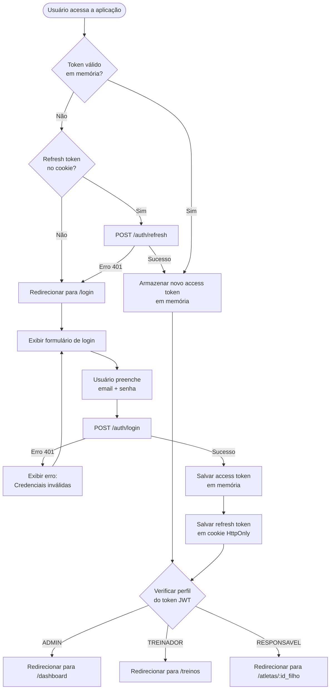
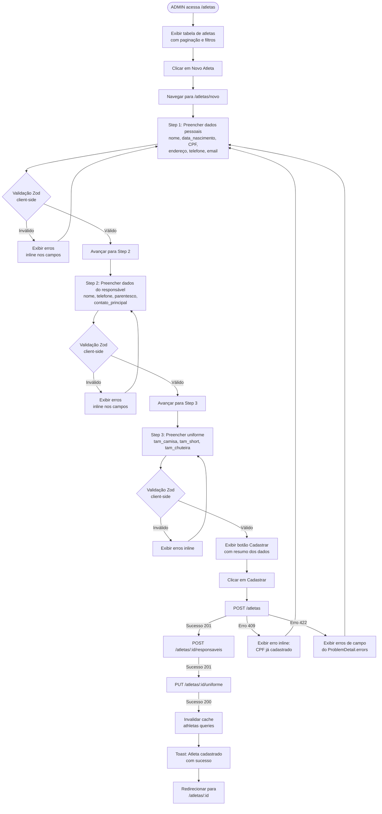
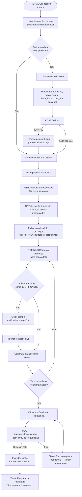
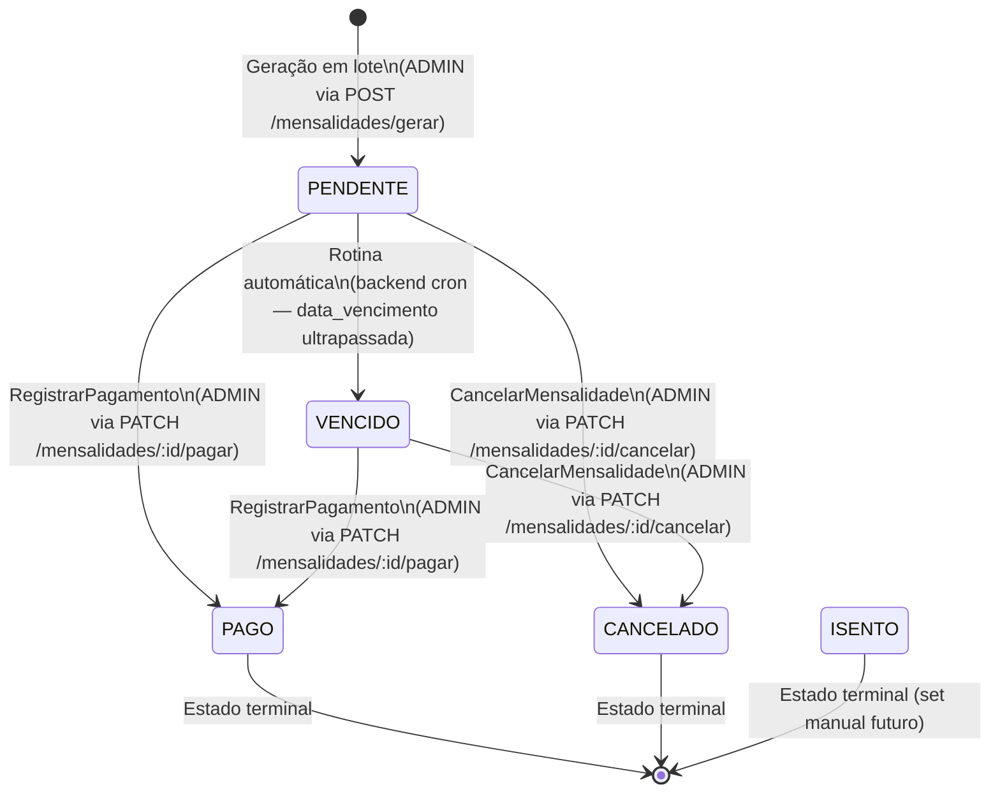
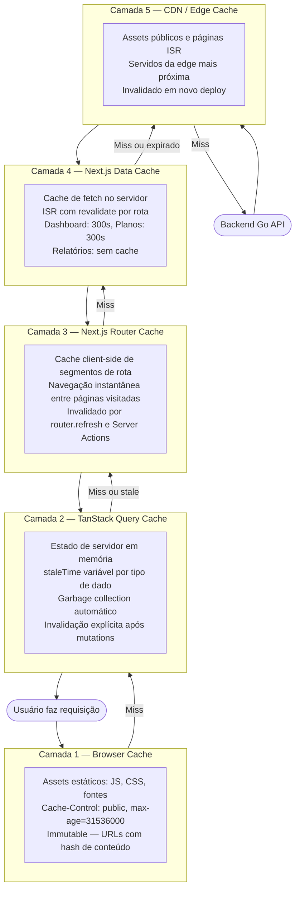

# realtpmsys — Arquitetura de Frontend

---

## 1. Visão Geral

O frontend do **realtpmsys** é uma aplicação web Single Page Application (SPA) híbrida construída sobre Next.js 15 com App Router, responsável por expor toda a interface de gerenciamento da escola de futebol. O sistema atende três perfis de usuário com responsabilidades distintas — ADMIN, TREINADOR e RESPONSAVEL — e precisa oferecer experiências diferenciadas a cada um deles sem sacrificar a coesão visual e a consistência operacional da plataforma.

A stack foi escolhida deliberadamente para equilibrar produtividade de desenvolvimento, performance de entrega e segurança de tipos de ponta a ponta. **Next.js 15 com App Router** fornece Server Components, Streaming, ISR e a separação clara entre rotas públicas (auth) e protegidas (app) via Route Groups, sem exigir configuração de roteamento manual. **TypeScript** é obrigatório em todo o projeto — não há JavaScript puro permitido — o que elimina classes inteiras de bugs de runtime especialmente em formulários com validação de negócio. **Tailwind CSS** acelera a implementação do design system sem criar camadas de abstração CSS desnecessárias, e funciona de forma nativa com os Server Components do Next.js. **TanStack Query v5** gerencia todo o estado de servidor (cache, revalidação, paginação, mutations otimistas), liberando o código de componentes de lógica de sincronização. **Zod** valida schemas tanto no cliente (formulários via React Hook Form) quanto na camada de parsing de respostas da API, garantindo que os DTOs consumidos pelos componentes estejam sempre no formato esperado.

Os três perfis de usuário têm jornadas fundamentalmente diferentes. O **ADMIN** possui acesso irrestrito a todas as seções: cadastro e gestão de atletas, turmas, planos e contratos financeiros, lançamento e revisão de mensalidades, geração de relatórios de inadimplência e frequência. O **TREINADOR** tem acesso focado em operações de campo: visualiza apenas as turmas pelas quais é responsável, cria sessões de treino e lança frequência dos atletas matriculados. O **RESPONSAVEL** tem acesso restrito ao perfil do próprio filho: visualiza dados pessoais, histórico de frequência e situação financeira das mensalidades, sem permissão de escrita. Essa diferenciação é implementada em dois níveis: no middleware de roteamento Next.js (redirecionamento por perfil após login) e nos componentes via hook `usePermission` e guard declarativo `<PermissionGuard>`.

O documento a seguir define a estrutura de pastas, os contratos de consumo de API, os fluxos de usuário, as estratégias de performance e os design tokens que devem estar implementados antes de qualquer código de feature. Ele deve ser tratado como fonte de verdade arquitetural durante toda a fase de desenvolvimento.

---

## 2. Bounded Contexts de Frontend (Feature Map)

| Feature | Bounded Context Backend | Responsabilidades de UI |
| --- | --- | --- |
| `auth` | Identidade | Formulário de login, armazenamento seguro de tokens JWT (access + refresh), guard de sessão, redirecionamento por perfil após login, renovação silenciosa de token expirado |
| `dashboard` | (todos) | Painel de KPIs agregados: total de atletas ativos, turmas ativas, inadimplência do mês corrente e taxa de presença. ADMIN vê dados globais; TREINADOR vê apenas suas turmas |
| `atletas` | Atletas | CRUD completo de atletas (formulário multi-step: dados pessoais, responsável, uniforme), listagem paginada com filtros por nome/status/turma, detalhe do atleta com histórico de matrículas |
| `turmas` | Turmas | Listagem e criação de turmas, gerenciamento de horários, matricular e desmatricular atletas, visualizar ocupação e vagas disponíveis |
| `treinos` | Frequência | Criar sessão de treino para uma turma em uma data, carregar lista de atletas matriculados, marcar presença/ausência/justificado para cada atleta em lote (operação idempotente) |
| `financeiro` | Financeiro | Três sub-features: **planos** (CRUD de planos de mensalidade), **contratos** (firmar contratos atleta-plano), **mensalidades** (listagem com resumo financeiro, registrar pagamento, cancelar, gerar lote mensal) |
| `relatorios` | Frequência + Financeiro | Relatório de inadimplência por competência (com lista de devedores e valor em aberto), relatório de frequência por atleta em período, relatório de frequência consolidado por turma em período |

---

## 3. Estrutura de Pastas (Feature-Based Architecture)

```
realtpmsys-web/
├── app/                                    # Next.js App Router
│   ├── (auth)/                             # Route group: sem layout principal
│   │   └── login/
│   │       ├── page.tsx                    # Página de login (SSR, sem cache)
│   │       └── loading.tsx                 # Skeleton do formulário de login
│   ├── (app)/                              # Route group: com layout principal
│   │   ├── layout.tsx                      # Layout raiz protegido: sidebar + header + auth guard
│   │   ├── dashboard/
│   │   │   ├── page.tsx                    # Dashboard com KPIs (ISR, revalidate: 300s)
│   │   │   └── loading.tsx                 # Skeleton dos cards de KPI
│   │   ├── atletas/
│   │   │   ├── page.tsx                    # Lista de atletas (CSR via TanStack Query)
│   │   │   ├── loading.tsx                 # Skeleton da tabela de atletas
│   │   │   ├── novo/
│   │   │   │   └── page.tsx                # Formulário multi-step de cadastro
│   │   │   └── [id]/
│   │   │       ├── page.tsx                # Detalhe do atleta (SSR + TanStack prefetch)
│   │   │       ├── editar/
│   │   │       │   └── page.tsx            # Edição dos dados do atleta
│   │   │       └── loading.tsx             # Skeleton do detalhe
│   │   ├── turmas/
│   │   │   ├── page.tsx                    # Lista de turmas (CSR)
│   │   │   ├── loading.tsx
│   │   │   ├── nova/
│   │   │   │   └── page.tsx                # Formulário de criação de turma
│   │   │   └── [id]/
│   │   │       ├── page.tsx                # Detalhe da turma com matrículas
│   │   │       └── loading.tsx
│   │   ├── treinos/
│   │   │   ├── page.tsx                    # Lista de sessões de treino por turma/data (CSR)
│   │   │   ├── loading.tsx
│   │   │   └── [id]/
│   │   │       ├── page.tsx                # Lançamento de frequência do treino
│   │   │       └── loading.tsx             # Skeleton da lista de atletas
│   │   ├── financeiro/
│   │   │   ├── mensalidades/
│   │   │   │   ├── page.tsx                # Lista de mensalidades com resumo (CSR)
│   │   │   │   ├── loading.tsx             # Skeleton da tabela + cards de resumo
│   │   │   │   └── gerar/
│   │   │   │       └── page.tsx            # Formulário para gerar lote mensal
│   │   │   ├── contratos/
│   │   │   │   ├── page.tsx                # Lista de contratos (CSR)
│   │   │   │   ├── loading.tsx
│   │   │   │   └── novo/
│   │   │   │       └── page.tsx            # Firmar novo contrato
│   │   │   └── planos/
│   │   │       ├── page.tsx                # Lista de planos (CSR)
│   │   │       ├── loading.tsx
│   │   │       └── novo/
│   │   │           └── page.tsx            # Criar novo plano
│   │   └── relatorios/
│   │       ├── page.tsx                    # Hub de relatórios disponíveis
│   │       ├── inadimplencia/
│   │       │   └── page.tsx                # Relatório de inadimplência (SSR sob demanda)
│   │       └── frequencia/
│   │           ├── atleta/
│   │           │   └── page.tsx            # Frequência por atleta (SSR sob demanda)
│   │           └── turma/
│   │               └── page.tsx            # Frequência por turma (SSR sob demanda)
│   ├── api/                                # Route Handlers (BFF)
│   │   └── auth/
│   │       └── session/
│   │           └── route.ts                # Endpoint BFF para validar sessão server-side
│   ├── middleware.ts                       # Proteção de rotas + redirecionamento por perfil
│   ├── layout.tsx                          # Root layout: providers, fonts, metadata global
│   ├── not-found.tsx                       # Página 404 customizada
│   └── error.tsx                           # Error boundary global
│
├── features/                               # Lógica de negócio por domínio
│   ├── auth/
│   │   ├── components/
│   │   │   ├── login-form.tsx              # Formulário de login com React Hook Form + Zod
│   │   │   └── auth-guard.tsx              # Componente client-side para proteção de rota
│   │   ├── hooks/
│   │   │   ├── use-auth.ts                 # Hook de login/logout com mutation TanStack
│   │   │   └── use-session.ts              # Hook para acessar dados da sessão atual
│   │   ├── schemas/
│   │   │   └── login.schema.ts             # loginSchema: { email, senha }
│   │   ├── services/
│   │   │   └── auth.service.ts             # authService.login(), authService.refresh()
│   │   └── types/
│   │       └── auth.types.ts               # AuthDTO, SessionUser, TokenPayload
│   │
│   ├── atletas/
│   │   ├── components/
│   │   │   ├── atleta-table.tsx            # Tabela paginada de atletas com filtros
│   │   │   ├── atleta-card.tsx             # Card resumo do atleta (usado no detalhe)
│   │   │   ├── atleta-form.tsx             # Step 1: dados pessoais do atleta
│   │   │   ├── atleta-form-wizard.tsx      # Orquestrador do formulário multi-step
│   │   │   ├── responsavel-form.tsx        # Step 2: dados do responsável
│   │   │   ├── uniforme-form.tsx           # Step 3: tamanhos de uniforme
│   │   │   ├── atleta-status-badge.tsx     # Badge de status ATIVO/INATIVO/SUSPENSO
│   │   │   └── atleta-filter-bar.tsx       # Barra de filtros (nome, status, turma)
│   │   ├── hooks/
│   │   │   ├── use-atletas.ts              # useAtletas(filter) — lista paginada
│   │   │   ├── use-atleta.ts               # useAtleta(id) — detalhe por ID
│   │   │   ├── use-cadastrar-atleta.ts     # useCadastrarAtleta() — mutation POST
│   │   │   ├── use-atualizar-atleta.ts     # useAtualizarAtleta(id) — mutation PUT
│   │   │   ├── use-adicionar-responsavel.ts # useAdicionarResponsavel(atletaId)
│   │   │   └── use-atualizar-uniforme.ts   # useAtualizarUniforme(atletaId)
│   │   ├── schemas/
│   │   │   ├── atleta.schema.ts            # atletaSchema (Zod)
│   │   │   ├── responsavel.schema.ts       # responsavelSchema (Zod)
│   │   │   └── uniforme.schema.ts          # uniformeSchema (Zod)
│   │   ├── services/
│   │   │   └── atleta.service.ts           # atletaService: listar, buscar, criar, atualizar
│   │   └── types/
│   │       └── atleta.types.ts             # AtletaDTO, AtletaFilter, AtletaListResponse
│   │
│   ├── turmas/
│   │   ├── components/
│   │   │   ├── turma-table.tsx             # Tabela de turmas com ocupação e status
│   │   │   ├── turma-form.tsx              # Formulário de criação/edição de turma
│   │   │   ├── horario-form.tsx            # Sub-formulário para horários da turma
│   │   │   ├── matricula-list.tsx          # Lista de atletas matriculados
│   │   │   └── matricular-atleta-modal.tsx # Modal para matricular atleta na turma
│   │   ├── hooks/
│   │   │   ├── use-turmas.ts               # useTurmas(filter)
│   │   │   ├── use-turma.ts                # useTurma(id)
│   │   │   ├── use-criar-turma.ts          # useCriarTurma()
│   │   │   ├── use-matriculas.ts           # useMatriculas(turmaId)
│   │   │   └── use-matricular-atleta.ts    # useMatricularAtleta(turmaId)
│   │   ├── schemas/
│   │   │   ├── turma.schema.ts
│   │   │   └── matricula.schema.ts
│   │   ├── services/
│   │   │   └── turma.service.ts
│   │   └── types/
│   │       └── turma.types.ts
│   │
│   ├── treinos/
│   │   ├── components/
│   │   │   ├── treino-list.tsx             # Lista de sessões agrupadas por data
│   │   │   ├── treino-form.tsx             # Formulário para criar sessão de treino
│   │   │   ├── frequencia-list.tsx         # Lista de atletas com checkboxes de presença
│   │   │   └── frequencia-status-badge.tsx # Badge PRESENTE/AUSENTE/JUSTIFICADO
│   │   ├── hooks/
│   │   │   ├── use-treinos.ts              # useTreinos(turmaId, data)
│   │   │   ├── use-criar-treino.ts         # useCriarTreino()
│   │   │   ├── use-frequencias.ts          # useFrequencias(treinoId)
│   │   │   └── use-lancar-frequencia.ts    # useLancarFrequencia(treinoId) — batch mutation
│   │   ├── schemas/
│   │   │   ├── treino.schema.ts
│   │   │   └── frequencia.schema.ts
│   │   ├── services/
│   │   │   └── treino.service.ts
│   │   └── types/
│   │       └── treino.types.ts
│   │
│   ├── financeiro/
│   │   ├── mensalidades/
│   │   │   ├── components/
│   │   │   │   ├── mensalidade-table.tsx         # Tabela com status e ações
│   │   │   │   ├── mensalidade-resumo-cards.tsx  # Cards: pendente/vencido/pago (R$)
│   │   │   │   ├── registrar-pagamento-modal.tsx # Modal com form de pagamento
│   │   │   │   ├── gerar-mensalidades-form.tsx   # Form: ano + mês para geração em lote
│   │   │   │   └── mensalidade-status-badge.tsx  # Badge de status financeiro
│   │   │   ├── hooks/
│   │   │   │   ├── use-mensalidades.ts           # useMensalidades(filter) com resumo
│   │   │   │   ├── use-mensalidade.ts            # useMensalidade(id)
│   │   │   │   ├── use-registrar-pagamento.ts    # useRegistrarPagamento() — optimistic
│   │   │   │   ├── use-cancelar-mensalidade.ts   # useCancelarMensalidade()
│   │   │   │   └── use-gerar-mensalidades.ts     # useGerarMensalidades()
│   │   │   ├── schemas/
│   │   │   │   ├── mensalidade.schema.ts
│   │   │   │   └── pagamento.schema.ts
│   │   │   ├── services/
│   │   │   │   └── mensalidade.service.ts
│   │   │   └── types/
│   │   │       └── mensalidade.types.ts
│   │   ├── contratos/
│   │   │   ├── components/
│   │   │   │   ├── contrato-table.tsx
│   │   │   │   └── contrato-form.tsx
│   │   │   ├── hooks/
│   │   │   │   ├── use-contratos.ts
│   │   │   │   └── use-firmar-contrato.ts
│   │   │   ├── schemas/
│   │   │   │   └── contrato.schema.ts
│   │   │   ├── services/
│   │   │   │   └── contrato.service.ts
│   │   │   └── types/
│   │   │       └── contrato.types.ts
│   │   └── planos/
│   │       ├── components/
│   │       │   ├── plano-list.tsx
│   │       │   └── plano-form.tsx
│   │       ├── hooks/
│   │       │   ├── use-planos.ts
│   │       │   └── use-criar-plano.ts
│   │       ├── schemas/
│   │       │   └── plano.schema.ts
│   │       ├── services/
│   │       │   └── plano.service.ts
│   │       └── types/
│   │           └── plano.types.ts
│   │
│   └── relatorios/
│       ├── components/
│       │   ├── inadimplencia-table.tsx       # Tabela de inadimplentes com valor em aberto
│       │   ├── inadimplencia-summary.tsx     # Cards: total atletas, % inadimplência, valor
│       │   ├── frequencia-atleta-chart.tsx   # Gráfico de barras: presença/ausência/justif.
│       │   └── frequencia-turma-table.tsx    # Tabela de frequência consolidada por turma
│       ├── hooks/
│       │   ├── use-relatorio-inadimplencia.ts
│       │   ├── use-relatorio-frequencia-atleta.ts
│       │   └── use-relatorio-frequencia-turma.ts
│       ├── services/
│       │   └── relatorio.service.ts
│       └── types/
│           └── relatorio.types.ts
│
├── shared/
│   ├── components/
│   │   ├── ui/
│   │   │   ├── button.tsx                  # Button com variantes: primary, secondary, ghost
│   │   │   ├── input.tsx                   # Input com label, error message e helper text
│   │   │   ├── select.tsx                  # Select acessível com opções tipadas
│   │   │   ├── modal.tsx                   # Modal com focus trap e acessibilidade
│   │   │   ├── table.tsx                   # Table com suporte a ordenação e paginação
│   │   │   ├── badge.tsx                   # Badge genérico com variantes de cor
│   │   │   ├── spinner.tsx                 # Indicador de carregamento inline
│   │   │   ├── pagination.tsx              # Controles de paginação com TanStack Query
│   │   │   ├── date-picker.tsx             # Date picker acessível
│   │   │   └── confirm-dialog.tsx          # Dialog de confirmação de ação destrutiva
│   │   ├── layout/
│   │   │   ├── sidebar.tsx                 # Sidebar com navegação por perfil
│   │   │   ├── header.tsx                  # Header com nome do usuário e logout
│   │   │   ├── page-header.tsx             # Cabeçalho de página com título e ações
│   │   │   └── breadcrumb.tsx              # Breadcrumb para navegação hierárquica
│   │   └── feedback/
│   │       ├── toast.tsx                   # Sistema de notificações (sucesso/erro/info)
│   │       ├── error-boundary.tsx          # Componente React de captura de erro
│   │       ├── empty-state.tsx             # Estado vazio com ação sugerida
│   │       └── loading-skeleton.tsx        # Skeleton loader genérico com shimmer
│   ├── hooks/
│   │   ├── use-pagination.ts               # Hook para controlar estado de paginação
│   │   ├── use-debounce.ts                 # Debounce de valor para inputs de busca
│   │   ├── use-permission.ts               # Verifica permissão do perfil atual
│   │   └── use-toast.ts                    # Hook para disparar notificações toast
│   ├── lib/
│   │   ├── api-client.ts                   # Instância fetch centralizada com interceptors
│   │   ├── query-client.ts                 # QueryClient TanStack com configuração global
│   │   ├── token-store.ts                  # Gerenciamento seguro de tokens em memória
│   │   └── utils.ts                        # formatCurrency, formatDate, formatCPF, cn()
│   └── types/
│       ├── api.ts                          # Pagination, ProblemDetail, ApiResponse<T>
│       └── auth.ts                         # Perfil enum, SessionUser
│
├── styles/
│   └── tokens.css                          # CSS custom properties (design tokens)
│
├── public/
│   ├── logo.svg
│   └── favicon.ico
│
├── .env.local                              # Variáveis de ambiente locais (não commitada)
├── .env.example                            # Template de variáveis de ambiente (commitada)
├── next.config.ts                          # Configuração do Next.js
├── tailwind.config.ts                      # Configuração do Tailwind com tokens
├── tsconfig.json                           # Configuração TypeScript
├── eslint.config.mjs                       # Configuração ESLint
└── package.json
```

**Regra de fronteiras entre features:** features nunca importam diretamente umas das outras. Se `financeiro/mensalidades` precisa exibir o nome de um atleta, ele recebe esse dado via prop ou via a própria resposta da API (que já inclui `atleta_nome`), nunca importando de `features/atletas/`. Toda lógica ou componente que precise ser compartilhado entre duas features deve ser promovido para `shared/`. Isso evita acoplamento circular e torna cada feature deployável e testável de forma independente.

---

## 4. User Flows (Mermaid.js)

### 4.1 — Fluxo de Autenticação e Roteamento por Perfil



### 4.2 — Fluxo: Cadastro de Atleta (ADMIN)



### 4.3 — Fluxo: Lançar Frequência (TREINADOR)



### 4.4 — Fluxo: Registrar Pagamento de Mensalidade (ADMIN)



### 4.5 — Mapa de Navegação (Sitemap)

```mermaid
graph LR
    LOGIN[/login] --> DASH[/dashboard]
    DASH --> ATL[/atletas]
    DASH --> TUR[/turmas]
    DASH --> TRE[/treinos]
    DASH --> FIN[/financeiro]
    DASH --> REL[/relatorios]

    ATL --> ATL_NOVO[/atletas/novo]
    ATL --> ATL_ID[/atletas/:id]
    ATL_ID --> ATL_EDIT[/atletas/:id/editar]

    TUR --> TUR_NOVA[/turmas/nova]
    TUR --> TUR_ID[/turmas/:id]

    TRE --> TRE_ID[/treinos/:id]

    FIN --> MEN[/financeiro/mensalidades]
    FIN --> CON[/financeiro/contratos]
    FIN --> PLA[/financeiro/planos]
    MEN --> MEN_GERAR[/financeiro/mensalidades/gerar]
    CON --> CON_NOVO[/financeiro/contratos/novo]
    PLA --> PLA_NOVO[/financeiro/planos/novo]

    REL --> REL_INAD[/relatorios/inadimplencia]
    REL --> REL_FREQ_ATL[/relatorios/frequencia/atleta]
    REL --> REL_FREQ_TUR[/relatorios/frequencia/turma]
```

---

## 5. Contratos de Consumo de API

### 5.1 — Cliente HTTP Centralizado

```typescript
// shared/lib/api-client.ts

const API_BASE_URL = process.env.NEXT_PUBLIC_API_URL ?? "http://localhost:8000/api/v1";

// Campos do RFC 7807 Problem Detail
export interface ApiError {
  type: string;
  title: string;
  status: number;
  detail: string;
  instance?: string;
  errors?: Array<{ field: string; message: string }>;
}

export class ApiRequestError extends Error {
  constructor(public readonly problem: ApiError) {
    super(problem.detail);
    this.name = "ApiRequestError";
  }
}

// Armazenamento de token em memória (não no localStorage por segurança)
let accessToken: string | null = null;

export function setAccessToken(token: string): void {
  accessToken = token;
}

export function clearAccessToken(): void {
  accessToken = null;
}

export function getAccessToken(): string | null {
  return accessToken;
}

async function parseErrorResponse(response: Response): Promise<ApiError> {
  try {
    const body = await response.json();
    // Verifica se é um Problem Detail válido (RFC 7807)
    if (body.type && body.title && body.status) {
      return body as ApiError;
    }
    // Fallback para respostas de erro sem formato RFC 7807
    return {
      type: `https://realtpmsys.local/errors/http-${response.status}`,
      title: response.statusText,
      status: response.status,
      detail: `Erro HTTP ${response.status}: ${response.statusText}`,
    };
  } catch {
    return {
      type: `https://realtpmsys.local/errors/http-${response.status}`,
      title: response.statusText,
      status: response.status,
      detail: `Erro HTTP ${response.status}: ${response.statusText}`,
    };
  }
}

// Controle de re-tentativa para evitar loop infinito de refresh
let isRefreshing = false;
let refreshPromise: Promise<string | null> | null = null;

async function refreshAccessToken(): Promise<string | null> {
  if (isRefreshing && refreshPromise) {
    return refreshPromise;
  }

  isRefreshing = true;
  refreshPromise = (async () => {
    try {
      // O refresh token é enviado automaticamente via cookie HttpOnly
      const response = await fetch(`${API_BASE_URL}/auth/refresh`, {
        method: "POST",
        credentials: "include",
        headers: { "Content-Type": "application/json" },
        body: JSON.stringify({}),
      });

      if (!response.ok) {
        clearAccessToken();
        return null;
      }

      const data = await response.json();
      setAccessToken(data.access_token as string);
      return data.access_token as string;
    } finally {
      isRefreshing = false;
      refreshPromise = null;
    }
  })();

  return refreshPromise;
}

interface RequestOptions extends Omit<RequestInit, "body"> {
  body?: unknown;
  skipAuth?: boolean;
}

export async function apiRequest<T>(
  path: string,
  options: RequestOptions = {}
): Promise<T> {
  const { body, skipAuth = false, ...fetchOptions } = options;

  const headers: Record<string, string> = {
    "Content-Type": "application/json",
    ...(fetchOptions.headers as Record<string, string>),
  };

  if (!skipAuth && accessToken) {
    headers["Authorization"] = `Bearer ${accessToken}`;
  }

  const response = await fetch(`${API_BASE_URL}${path}`, {
    ...fetchOptions,
    credentials: "include",
    headers,
    body: body !== undefined ? JSON.stringify(body) : undefined,
  });

  // Tentar renovar token automaticamente em caso de 401
  if (response.status === 401 && !skipAuth) {
    const newToken = await refreshAccessToken();

    if (!newToken) {
      // Refresh falhou: redirecionar para login
      if (typeof window !== "undefined") {
        window.location.href = "/login";
      }
      const problem = await parseErrorResponse(response);
      throw new ApiRequestError(problem);
    }

    // Repetir a requisição original com o novo token
    const retryResponse = await fetch(`${API_BASE_URL}${path}`, {
      ...fetchOptions,
      credentials: "include",
      headers: { ...headers, Authorization: `Bearer ${newToken}` },
      body: body !== undefined ? JSON.stringify(body) : undefined,
    });

    if (!retryResponse.ok) {
      const problem = await parseErrorResponse(retryResponse);
      throw new ApiRequestError(problem);
    }

    if (retryResponse.status === 204) {
      return undefined as T;
    }

    return retryResponse.json() as Promise<T>;
  }

  if (!response.ok) {
    const problem = await parseErrorResponse(response);
    throw new ApiRequestError(problem);
  }

  if (response.status === 204) {
    return undefined as T;
  }

  return response.json() as Promise<T>;
}
```

### 5.2 — DTOs e Schemas Zod por Feature

```typescript
// shared/types/api.ts

export interface Pagination {
  total: number;
  page: number;
  per_page: number;
  pages: number;
}

export interface ApiListResponse<T> {
  data: T[];
  pagination: Pagination;
}
```

```typescript
// features/atletas/schemas/atleta.schema.ts
import { z } from "zod";

export const atletaStatusSchema = z.enum(["ATIVO", "INATIVO", "SUSPENSO"]);

export const atletaRequestSchema = z.object({
  nome: z.string().min(1, "Nome é obrigatório").max(150, "Nome deve ter no máximo 150 caracteres"),
  data_nascimento: z
    .string()
    .regex(/^\d{4}-\d{2}-\d{2}$/, "Data deve estar no formato AAAA-MM-DD"),
  cpf: z
    .string()
    .regex(/^\d{11}$/, "CPF deve conter exatamente 11 dígitos numéricos")
    .optional(),
  rg: z.string().max(20).optional(),
  endereco: z.string().max(200).optional(),
  cidade: z.string().max(100).optional(),
  uf: z
    .string()
    .regex(/^[A-Z]{2}$/, "UF deve conter 2 letras maiúsculas")
    .optional(),
  cep: z
    .string()
    .regex(/^\d{8}$/, "CEP deve conter 8 dígitos numéricos")
    .optional(),
  email: z.string().email("E-mail inválido").optional(),
  telefone: z.string().max(15).optional(),
});

export const responsavelParentescoSchema = z.enum(["PAI", "MAE", "AVO", "OUTRO"]);

export const responsavelRequestSchema = z.object({
  nome: z.string().min(1, "Nome é obrigatório").max(150),
  cpf: z.string().regex(/^\d{11}$/, "CPF deve conter exatamente 11 dígitos").optional(),
  email: z.string().email("E-mail inválido").optional(),
  telefone: z.string().min(1, "Telefone é obrigatório").max(15),
  parentesco: responsavelParentescoSchema,
  contato_principal: z.boolean().default(false),
});

export const tamUniformeSchema = z.enum(["PP", "P", "M", "G", "GG", "XGG"]);

export const uniformeRequestSchema = z.object({
  tam_camisa: tamUniformeSchema,
  tam_short: tamUniformeSchema,
  tam_chuteira: z.string().min(1, "Tamanho de chuteira é obrigatório"),
});

export const atletaFilterSchema = z.object({
  nome: z.string().optional(),
  status: atletaStatusSchema.optional(),
  turma_id: z.string().uuid().optional(),
  page: z.number().int().positive().default(1),
  per_page: z.number().int().positive().max(100).default(20),
});
```

```typescript
// features/atletas/types/atleta.types.ts
import { z } from "zod";
import type { Pagination } from "@/shared/types/api";
import {
  atletaRequestSchema,
  atletaStatusSchema,
  atletaFilterSchema,
  responsavelRequestSchema,
  uniformeRequestSchema,
  tamUniformeSchema,
  responsavelParentescoSchema,
} from "../schemas/atleta.schema";

export type AtletaStatus = z.infer<typeof atletaStatusSchema>;
export type AtletaRequest = z.infer<typeof atletaRequestSchema>;
export type AtletaFilter = z.infer<typeof atletaFilterSchema>;
export type ResponsavelRequest = z.infer<typeof responsavelRequestSchema>;
export type ResponsavelParentesco = z.infer<typeof responsavelParentescoSchema>;
export type TamUniforme = z.infer<typeof tamUniformeSchema>;
export type UniformeRequest = z.infer<typeof uniformeRequestSchema>;

export interface ResponsavelDTO {
  id: string;
  atleta_id: string;
  nome: string;
  cpf?: string;
  email?: string;
  telefone: string;
  parentesco: ResponsavelParentesco;
  contato_principal: boolean;
}

export interface UniformeDTO {
  id: string;
  atleta_id: string;
  tam_camisa: TamUniforme;
  tam_short: TamUniforme;
  tam_chuteira: string;
}

export interface AtletaDTO {
  id: string;
  nome: string;
  data_nascimento: string;
  cpf?: string;
  email?: string;
  telefone?: string;
  status: AtletaStatus;
  responsaveis: ResponsavelDTO[];
  uniforme?: UniformeDTO;
  criado_em: string;
  atualizado_em: string;
}

export interface AtletaListResponse {
  data: AtletaDTO[];
  pagination: Pagination;
}
```

```typescript
// features/financeiro/mensalidades/schemas/mensalidade.schema.ts
import { z } from "zod";

export const mensalidadeStatusSchema = z.enum([
  "PENDENTE",
  "PAGO",
  "VENCIDO",
  "CANCELADO",
  "ISENTO",
]);

export const formaPagamentoSchema = z.enum([
  "PIX",
  "DINHEIRO",
  "CARTAO_DEBITO",
  "CARTAO_CREDITO",
  "BOLETO",
  "TRANSFERENCIA",
]);

export const registrarPagamentoSchema = z.object({
  valor_pago: z
    .number({ invalid_type_error: "Valor deve ser um número" })
    .positive("Valor deve ser maior que zero"),
  data_pagamento: z
    .string()
    .regex(/^\d{4}-\d{2}-\d{2}$/, "Data deve estar no formato AAAA-MM-DD"),
  forma_pagamento: formaPagamentoSchema,
  observacao: z.string().nullable().optional(),
});

export const gerarMensalidadesSchema = z.object({
  competencia_ano: z
    .number({ invalid_type_error: "Ano deve ser um número" })
    .int()
    .min(2020, "Ano inválido")
    .max(2100, "Ano inválido"),
  competencia_mes: z
    .number({ invalid_type_error: "Mês deve ser um número" })
    .int()
    .min(1, "Mês deve ser entre 1 e 12")
    .max(12, "Mês deve ser entre 1 e 12"),
});

export const mensalidadeFilterSchema = z.object({
  atleta_id: z.string().uuid().optional(),
  status: mensalidadeStatusSchema.optional(),
  competencia_ano: z.number().int().optional(),
  competencia_mes: z.number().int().min(1).max(12).optional(),
  page: z.number().int().positive().default(1),
  per_page: z.number().int().positive().max(100).default(20),
});
```

```typescript
// features/financeiro/mensalidades/types/mensalidade.types.ts
import { z } from "zod";
import type { Pagination } from "@/shared/types/api";
import {
  mensalidadeStatusSchema,
  formaPagamentoSchema,
  registrarPagamentoSchema,
  gerarMensalidadesSchema,
  mensalidadeFilterSchema,
} from "../schemas/mensalidade.schema";

export type MensalidadeStatus = z.infer<typeof mensalidadeStatusSchema>;
export type FormaPagamento = z.infer<typeof formaPagamentoSchema>;
export type RegistrarPagamentoRequest = z.infer<typeof registrarPagamentoSchema>;
export type GerarMensalidadesRequest = z.infer<typeof gerarMensalidadesSchema>;
export type MensalidadeFilter = z.infer<typeof mensalidadeFilterSchema>;

export interface MensalidadeDTO {
  id: string;
  atleta_id: string;
  atleta_nome: string;
  competencia_ano: number;
  competencia_mes: number;
  data_vencimento: string;
  valor: number;
  valor_pago: number | null;
  status: MensalidadeStatus;
  data_pagamento: string | null;
  forma_pagamento: string | null;
}

export interface MensalidadeResumo {
  total_pendente: number;
  total_vencido: number;
  total_pago: number;
}

export interface MensalidadeListResponse {
  data: MensalidadeDTO[];
  pagination: Pagination;
  resumo: MensalidadeResumo;
}

export interface GerarMensalidadesResponse {
  geradas: number;
  ignoradas: number;
  com_erro: number;
}
```

### 5.3 — Hooks TanStack Query

```typescript
// features/atletas/hooks/use-atletas.ts
import { useQuery, useMutation, useQueryClient } from "@tanstack/react-query";
import { useToast } from "@/shared/hooks/use-toast";
import { ApiRequestError } from "@/shared/lib/api-client";
import { atletaService } from "../services/atleta.service";
import type { AtletaFilter, AtletaRequest } from "../types/atleta.types";

// Query key factory — centraliza a nomenclatura das chaves de cache
export const atletaKeys = {
  all: ["atletas"] as const,
  lists: () => [...atletaKeys.all, "list"] as const,
  list: (filter: AtletaFilter) => [...atletaKeys.lists(), filter] as const,
  details: () => [...atletaKeys.all, "detail"] as const,
  detail: (id: string) => [...atletaKeys.details(), id] as const,
};

export function useAtletas(filter: AtletaFilter) {
  return useQuery({
    queryKey: atletaKeys.list(filter),
    queryFn: () => atletaService.listar(filter),
    staleTime: 2 * 60 * 1000, // 2 minutos — lista muda com frequência moderada
    placeholderData: (previousData) => previousData, // mantém dados anteriores durante paginação
  });
}

export function useAtleta(id: string) {
  return useQuery({
    queryKey: atletaKeys.detail(id),
    queryFn: () => atletaService.buscar(id),
    staleTime: 30 * 1000, // 30 segundos — detalhe pode ser editado
    enabled: Boolean(id),
  });
}

export function useCadastrarAtleta() {
  const queryClient = useQueryClient();
  const { toast } = useToast();

  return useMutation({
    mutationFn: (data: AtletaRequest) => atletaService.criar(data),
    onSuccess: (novoAtleta) => {
      // Invalidar lista para incluir o novo atleta
      queryClient.invalidateQueries({ queryKey: atletaKeys.lists() });
      // Pré-popular o cache do detalhe para navegação instantânea
      queryClient.setQueryData(atletaKeys.detail(novoAtleta.id), novoAtleta);
      toast({
        type: "success",
        title: "Atleta cadastrado",
        description: `${novoAtleta.nome} foi cadastrado com sucesso.`,
      });
    },
    onError: (error: ApiRequestError) => {
      toast({
        type: "error",
        title: "Erro ao cadastrar atleta",
        description: error.problem.detail,
      });
    },
  });
}
```

```typescript
// features/financeiro/mensalidades/hooks/use-mensalidades.ts
import { useQuery, useMutation, useQueryClient } from "@tanstack/react-query";
import { useToast } from "@/shared/hooks/use-toast";
import { ApiRequestError } from "@/shared/lib/api-client";
import { mensalidadeService } from "../services/mensalidade.service";
import type {
  MensalidadeFilter,
  MensalidadeDTO,
  RegistrarPagamentoRequest,
} from "../types/mensalidade.types";

export const mensalidadeKeys = {
  all: ["mensalidades"] as const,
  lists: () => [...mensalidadeKeys.all, "list"] as const,
  list: (filter: MensalidadeFilter) => [...mensalidadeKeys.lists(), filter] as const,
  details: () => [...mensalidadeKeys.all, "detail"] as const,
  detail: (id: string) => [...mensalidadeKeys.details(), id] as const,
};

export function useMensalidades(filter: MensalidadeFilter) {
  return useQuery({
    queryKey: mensalidadeKeys.list(filter),
    queryFn: () => mensalidadeService.listar(filter),
    staleTime: 1 * 60 * 1000, // 1 minuto — dados financeiros mudam com mais frequência
    placeholderData: (previousData) => previousData,
  });
}

interface RegistrarPagamentoVariables {
  mensalidadeId: string;
  data: RegistrarPagamentoRequest;
}

export function useRegistrarPagamento() {
  const queryClient = useQueryClient();
  const { toast } = useToast();

  return useMutation({
    mutationFn: ({ mensalidadeId, data }: RegistrarPagamentoVariables) =>
      mensalidadeService.registrarPagamento(mensalidadeId, data),

    // Optimistic update: atualiza o cache imediatamente antes da resposta da API
    onMutate: async ({ mensalidadeId, data }) => {
      // Cancelar queries em voo para evitar conflito com o optimistic update
      await queryClient.cancelQueries({ queryKey: mensalidadeKeys.all });

      // Salvar snapshot do estado anterior para rollback
      const previousDetail = queryClient.getQueryData<MensalidadeDTO>(
        mensalidadeKeys.detail(mensalidadeId)
      );

      // Aplicar update otimista no detalhe
      if (previousDetail) {
        queryClient.setQueryData<MensalidadeDTO>(mensalidadeKeys.detail(mensalidadeId), {
          ...previousDetail,
          status: "PAGO",
          valor_pago: data.valor_pago,
          data_pagamento: data.data_pagamento,
          forma_pagamento: data.forma_pagamento,
        });
      }

      // Aplicar update otimista em todas as listas em cache
      queryClient.setQueriesData<{ data: MensalidadeDTO[]; pagination: unknown; resumo: unknown }>(
        { queryKey: mensalidadeKeys.lists() },
        (old) => {
          if (!old) return old;
          return {
            ...old,
            data: old.data.map((m) =>
              m.id === mensalidadeId
                ? { ...m, status: "PAGO" as const, valor_pago: data.valor_pago }
                : m
            ),
          };
        }
      );

      return { previousDetail };
    },

    onSuccess: (mensalidadeAtualizada) => {
      // Sincronizar com o valor real retornado pela API
      queryClient.setQueryData(
        mensalidadeKeys.detail(mensalidadeAtualizada.id),
        mensalidadeAtualizada
      );
      // Invalidar listas para atualizar o resumo financeiro (totais)
      queryClient.invalidateQueries({ queryKey: mensalidadeKeys.lists() });
      toast({
        type: "success",
        title: "Pagamento registrado",
        description: `Mensalidade de ${mensalidadeAtualizada.atleta_nome} marcada como paga.`,
      });
    },

    onError: (error: ApiRequestError, _variables, context) => {
      // Rollback do optimistic update
      if (context?.previousDetail) {
        queryClient.setQueryData(
          mensalidadeKeys.detail(context.previousDetail.id),
          context.previousDetail
        );
      }
      queryClient.invalidateQueries({ queryKey: mensalidadeKeys.all });
      toast({
        type: "error",
        title: "Erro ao registrar pagamento",
        description: error.problem.detail,
      });
    },
  });
}
```

```typescript
// features/treinos/hooks/use-frequencia.ts
import { useMutation, useQueryClient } from "@tanstack/react-query";
import { useToast } from "@/shared/hooks/use-toast";
import { ApiRequestError } from "@/shared/lib/api-client";
import { treinoService } from "../services/treino.service";
import type { FrequenciaItemRequest } from "../types/treino.types";

export const frequenciaKeys = {
  all: ["frequencias"] as const,
  byTreino: (treinoId: string) => [...frequenciaKeys.all, treinoId] as const,
};

export function useLancarFrequencia(treinoId: string) {
  const queryClient = useQueryClient();
  const { toast } = useToast();

  return useMutation({
    mutationFn: (frequencias: FrequenciaItemRequest[]) =>
      treinoService.lancarFrequencia(treinoId, { frequencias }),

    onSuccess: (resultado) => {
      // Invalidar frequências deste treino para recarregar do servidor
      queryClient.invalidateQueries({ queryKey: frequenciaKeys.byTreino(treinoId) });
      toast({
        type: "success",
        title: "Frequência registrada",
        description: `${resultado.registradas} registradas, ${resultado.atualizadas} atualizadas.`,
      });
    },

    onError: (error: ApiRequestError) => {
      toast({
        type: "error",
        title: "Erro ao lançar frequência",
        description: error.problem.detail,
      });
    },
  });
}
```

### 5.4 — Tabela de Estratégias de Renderização

| Rota | Estratégia | Justificativa | `revalidate` / `staleTime` |
| --- | --- | --- | --- |
| `/login` | SSR | Página pública sem cache; nunca deve ser servida de cache de CDN | — |
| `/dashboard` | ISR | KPIs são semi-estáticos; usuários diferentes veem dados similares; ISR reduz carga no backend | 5 min (300s) |
| `/atletas` | CSR (TanStack) | Filtros por nome/status/turma são interativos e variam por usuário; não faz sentido pré-renderizar | 2 min |
| `/atletas/[id]` | SSR + TanStack prefetch | SEO não é requisito, mas prefetch server-side elimina loading state na navegação direta | 30s |
| `/turmas` | CSR | Lista interativa com filtros; dados variam conforme perfil (TREINADOR vê subset) | 2 min |
| `/treinos` | CSR | Dados operacionais do dia; TREINADOR precisa de dados frescos para não lançar frequência duplicada | 1 min |
| `/financeiro/mensalidades` | CSR (TanStack) | Filtros dinâmicos + resumo financeiro calculado; dados mudam após cada pagamento | 1 min |
| `/financeiro/contratos` | CSR | Lista transacional; filtros por atleta e status | 2 min |
| `/financeiro/planos` | CSR | Lista estável mas editável; cache mais longo é aceitável | 5 min |
| `/relatorios/*` | SSR | Dados sob demanda com query params (ano/mês, período); sem cache para garantir precisão | sem cache |

---

## 6. Performance & Core Web Vitals

### 6.1 — Metas e Orçamento de Performance

| Métrica | Meta | Estratégia Principal |
| --- | --- | --- |
| LCP | < 2.5s | ISR no dashboard, `next/image` com prioridade em imagens above-the-fold, prefetch de rotas críticas |
| INP | < 200ms | Server Components para listas pesadas, paginação server-side, evitar re-renders desnecessários com `useMemo` |
| CLS | < 0.1 | Skeleton loaders com dimensões fixas antes do dado carregar, `next/image` com `width` e `height` explícitos |
| TTFB | < 600ms | Edge Runtime para middleware de auth, CDN para assets estáticos, ISR para dashboard |
| Bundle inicial | < 150kb gzip | `dynamic()` para modais e bibliotecas de gráficos, tree-shaking, sem imports de barrel desnecessários |

### 6.2 — Arquitetura de Cache em 5 Camadas



### 6.3 — Estratégias de Code Splitting

```typescript
// app/(app)/atletas/page.tsx
// Modal de cadastro de atleta — não carregado no bundle da lista
import dynamic from "next/dynamic";

const CadastrarAtletaModal = dynamic(
  () => import("@/features/atletas/components/atleta-form-wizard"),
  {
    loading: () => <Spinner />,
    // ssr: false pois o modal depende de estado client-side (React Hook Form)
    ssr: false,
  }
);
```

```typescript
// features/relatorios/components/inadimplencia-summary.tsx
// Biblioteca de gráficos é pesada — carregada apenas quando o componente é montado
import dynamic from "next/dynamic";

const InadimplenciaBarChart = dynamic(
  () => import("./inadimplencia-bar-chart"),
  {
    loading: () => (
      // Skeleton com dimensões fixas para evitar CLS
      <div className="w-full h-64 animate-pulse bg-surface rounded-lg" />
    ),
    ssr: false,
  }
);
```

```typescript
// app/(app)/treinos/[id]/page.tsx
// Formulário de lançamento de frequência — exclusivo para TREINADOR
// Evita carregar o componente no bundle de ADMIN e RESPONSAVEL
import dynamic from "next/dynamic";
import { usePermission } from "@/shared/hooks/use-permission";

const FrequenciaLancamentoForm = dynamic(
  () => import("@/features/treinos/components/frequencia-list"),
  {
    loading: () => <LoadingSkeleton rows={15} />,
    ssr: false,
  }
);

export default function TreinoDetailPage() {
  const { hasRole } = usePermission();

  return (
    <div>
      {/* ... cabeçalho */}
      {hasRole(["ADMIN", "TREINADOR"]) && <FrequenciaLancamentoForm />}
    </div>
  );
}
```

### 6.4 — Checklist de Performance

- [ ] **Bundle size:** Auditar com `next build --analyze` antes de cada release. Bundle inicial deve ficar abaixo de 150kb gzip
- [ ] **Imagens:** Todas as imagens usam `next/image` com `width`, `height` e `alt` explícitos. Nenhum `` HTML puro no codebase
- [ ] **Fontes:** Todas as fontes carregadas via `next/font` com `display: swap` e subconjuntos (`subset: ["latin"]`). Nenhum `@import` de Google Fonts no CSS
- [ ] **Prefetch de rotas:** Links de navegação frequente (`/atletas`, `/treinos`) usam `<Link prefetch>` explícito para pré-carregar no hover
- [ ] **Suspense boundaries:** Toda seção com dados assíncronos está envolvida em `<Suspense fallback={<Skeleton />}>`. Nenhum loading state implementado com `if (isLoading) return null`
- [ ] **Skeleton loaders:** Todos os skeletons têm dimensões que correspondem ao conteúdo real (altura, largura) para evitar CLS no carregamento
- [ ] **React.memo:** Componentes de linha de tabela (`AtletaRow`, `MensalidadeRow`) memorizados para evitar re-render da lista inteira ao paginar
- [ ] **useMemo:** Cálculos derivados de listas longas (ordenação, agregação de totais) protegidos com `useMemo` quando a lista tem mais de 50 itens
- [ ] **Server vs Client Components:** Componentes que não usam hooks, event handlers ou APIs de browser devem ser Server Components. Usar `"use client"` apenas quando necessário
- [ ] **Lazy loading de modais:** Nenhum modal é incluído no bundle da página pai. Todos os modais usam `dynamic()` com `ssr: false`
- [ ] **Stale time adequado:** Dados que raramente mudam (planos, turmas) têm `staleTime` maior (5 min). Dados operacionais (frequências, mensalidades) têm `staleTime` menor (1 min)
- [ ] **Lighthouse CI:** Pipeline de CI executa `lhci autorun` em cada PR. Score de Performance deve estar acima de 80 em ambiente de staging

---

## 7. Design Tokens

### 7.1 — Paleta e Semântica

A paleta do realtpmsys é construída em torno do contexto visual de uma escola de futebol, com identidade clara e hierarquia de informação bem definida.

**Verde campo (`#16a34a`, green-600 como primary):** A cor principal da plataforma remete diretamente ao gramado. É usado em botões de ação primária, links ativos na sidebar, indicadores de status positivo (ATIVO, PAGO) e elementos de destaque de marca. O verde evita o clichê do azul corporativo sem perder seriedade.

**Azul escuro / Slate (`#0f172a`, slate-950 como background no dark mode):** Fornece profundidade ao tema escuro e é usado como cor de fundo de surface no dark mode. No light mode, o background é branco (`#ffffff`) e as surfaces são `slate-50`. O slate, ao contrário de um preto puro, suaviza o contraste e é mais confortável para sessões longas de trabalho (treinadores lançando frequência no campo).

**Dourado (`#f59e0b`, amber-500 como accent/warning):** Usado para alertas, status PENDENTE e VENCIDO, e para destacar informações que requerem atenção do ADMIN (inadimplência, mensalidades vencidas). O dourado transmite urgência sem a agressividade do vermelho.

**Vermelho (`#dc2626`, red-600):** Reservado exclusivamente para erros, ações destrutivas (cancelar mensalidade, inativar atleta) e status críticos. O uso restrito garante que o vermelho retenha seu poder de atenção.

### 7.2 — Arquivo de Tokens CSS

```css
/* styles/tokens.css */

/* ==========================================================================
   NÍVEL 1 — PRIMITIVOS (valores brutos, sem semântica de negócio)
   ========================================================================== */

:root {

  /* --- Green scale --- */
  --color-green-50:  #f0fdf4;
  --color-green-100: #dcfce7;
  --color-green-200: #bbf7d0;
  --color-green-300: #86efac;
  --color-green-400: #4ade80;
  --color-green-500: #22c55e;
  --color-green-600: #16a34a;
  --color-green-700: #15803d;
  --color-green-800: #166534;
  --color-green-900: #14532d;
  --color-green-950: #052e16;

  /* --- Slate scale --- */
  --color-slate-50:  #f8fafc;
  --color-slate-100: #f1f5f9;
  --color-slate-200: #e2e8f0;
  --color-slate-300: #cbd5e1;
  --color-slate-400: #94a3b8;
  --color-slate-500: #64748b;
  --color-slate-600: #475569;
  --color-slate-700: #334155;
  --color-slate-800: #1e293b;
  --color-slate-900: #0f172a;
  --color-slate-950: #020617;

  /* --- Amber / Gold scale --- */
  --color-amber-50:  #fffbeb;
  --color-amber-100: #fef3c7;
  --color-amber-200: #fde68a;
  --color-amber-300: #fcd34d;
  --color-amber-400: #fbbf24;
  --color-amber-500: #f59e0b;
  --color-amber-600: #d97706;
  --color-amber-700: #b45309;
  --color-amber-800: #92400e;
  --color-amber-900: #78350f;

  /* --- Red scale --- */
  --color-red-50:  #fef2f2;
  --color-red-100: #fee2e2;
  --color-red-200: #fecaca;
  --color-red-300: #fca5a5;
  --color-red-400: #f87171;
  --color-red-500: #ef4444;
  --color-red-600: #dc2626;
  --color-red-700: #b91c1c;
  --color-red-800: #991b1b;
  --color-red-900: #7f1d1d;

  /* --- Blue scale (informação) --- */
  --color-blue-50:  #eff6ff;
  --color-blue-100: #dbeafe;
  --color-blue-500: #3b82f6;
  --color-blue-600: #2563eb;
  --color-blue-700: #1d4ed8;

  /* --- White / Black --- */
  --color-white: #ffffff;
  --color-black: #000000;

  /* --- Typography --- */
  --font-size-xs:   0.75rem;    /* 12px */
  --font-size-sm:   0.875rem;   /* 14px */
  --font-size-base: 1rem;       /* 16px */
  --font-size-lg:   1.125rem;   /* 18px */
  --font-size-xl:   1.25rem;    /* 20px */
  --font-size-2xl:  1.5rem;     /* 24px */
  --font-size-3xl:  1.875rem;   /* 30px */
  --font-size-4xl:  2.25rem;    /* 36px */

  --font-weight-normal:   400;
  --font-weight-medium:   500;
  --font-weight-semibold: 600;
  --font-weight-bold:     700;

  --line-height-tight:  1.25;
  --line-height-snug:   1.375;
  --line-height-normal: 1.5;
  --line-height-relaxed: 1.625;

  /* --- Spacing (base: 4px = 0.25rem) --- */
  --space-0:   0;
  --space-1:   0.25rem;    /* 4px */
  --space-2:   0.5rem;     /* 8px */
  --space-3:   0.75rem;    /* 12px */
  --space-4:   1rem;       /* 16px */
  --space-5:   1.25rem;    /* 20px */
  --space-6:   1.5rem;     /* 24px */
  --space-8:   2rem;       /* 32px */
  --space-10:  2.5rem;     /* 40px */
  --space-12:  3rem;       /* 48px */
  --space-16:  4rem;       /* 64px */
  --space-20:  5rem;       /* 80px */

  /* --- Border Radius --- */
  --radius-sm:   0.25rem;   /* 4px */
  --radius-md:   0.375rem;  /* 6px */
  --radius-lg:   0.5rem;    /* 8px */
  --radius-xl:   0.75rem;   /* 12px */
  --radius-2xl:  1rem;      /* 16px */
  --radius-full: 9999px;

  /* --- Shadows --- */
  --shadow-sm:  0 1px 2px 0 rgb(0 0 0 / 0.05);
  --shadow-md:  0 4px 6px -1px rgb(0 0 0 / 0.1), 0 2px 4px -2px rgb(0 0 0 / 0.1);
  --shadow-lg:  0 10px 15px -3px rgb(0 0 0 / 0.1), 0 4px 6px -4px rgb(0 0 0 / 0.1);
  --shadow-xl:  0 20px 25px -5px rgb(0 0 0 / 0.1), 0 8px 10px -6px rgb(0 0 0 / 0.1);

  /* --- Transitions --- */
  --transition-fast:   150ms ease;
  --transition-normal: 200ms ease;
  --transition-slow:   300ms ease;

  /* --- Z-index --- */
  --z-dropdown: 100;
  --z-sticky:   200;
  --z-overlay:  300;
  --z-modal:    400;
  --z-toast:    500;
}

/* ==========================================================================
   NÍVEL 2 — SEMÂNTICOS (significado de negócio, referenciam primitivos)
   ========================================================================== */

:root {

  /* --- Cores primárias --- */
  --color-primary:           var(--color-green-600);
  --color-primary-hover:     var(--color-green-700);
  --color-primary-active:    var(--color-green-800);
  --color-primary-subtle:    var(--color-green-50);
  --color-primary-foreground: var(--color-white);

  /* --- Cores de destaque (accent / warning) --- */
  --color-accent:            var(--color-amber-500);
  --color-accent-hover:      var(--color-amber-600);
  --color-accent-subtle:     var(--color-amber-50);
  --color-accent-foreground: var(--color-white);

  /* --- Cores de perigo / destrutivo --- */
  --color-danger:            var(--color-red-600);
  --color-danger-hover:      var(--color-red-700);
  --color-danger-subtle:     var(--color-red-50);
  --color-danger-foreground: var(--color-white);

  /* --- Cores de informação --- */
  --color-info:              var(--color-blue-600);
  --color-info-subtle:       var(--color-blue-50);
  --color-info-foreground:   var(--color-white);

  /* --- Status de Atleta --- */
  --color-status-ativo:      var(--color-green-600);
  --color-status-ativo-bg:   var(--color-green-50);
  --color-status-inativo:    var(--color-slate-500);
  --color-status-inativo-bg: var(--color-slate-100);
  --color-status-suspenso:   var(--color-red-600);
  --color-status-suspenso-bg: var(--color-red-50);

  /* --- Status de Mensalidade --- */
  --color-status-pendente:    var(--color-amber-600);
  --color-status-pendente-bg: var(--color-amber-50);
  --color-status-pago:        var(--color-green-600);
  --color-status-pago-bg:     var(--color-green-50);
  --color-status-vencido:     var(--color-red-600);
  --color-status-vencido-bg:  var(--color-red-50);
  --color-status-cancelado:   var(--color-slate-500);
  --color-status-cancelado-bg: var(--color-slate-100);
  --color-status-isento:      var(--color-blue-600);
  --color-status-isento-bg:   var(--color-blue-50);

  /* --- Status de Frequência --- */
  --color-status-presente:    var(--color-green-600);
  --color-status-presente-bg: var(--color-green-50);
  --color-status-ausente:     var(--color-red-600);
  --color-status-ausente-bg:  var(--color-red-50);
  --color-status-justificado:    var(--color-amber-600);
  --color-status-justificado-bg: var(--color-amber-50);

  /* --- Status de Turma --- */
  --color-status-turma-ativa:     var(--color-green-600);
  --color-status-turma-ativa-bg:  var(--color-green-50);
  --color-status-turma-encerrada: var(--color-slate-500);
  --color-status-turma-encerrada-bg: var(--color-slate-100);
  --color-status-turma-suspensa:  var(--color-amber-600);
  --color-status-turma-suspensa-bg: var(--color-amber-50);

  /* --- Superfícies e backgrounds (light mode) --- */
  --color-background:        var(--color-white);
  --color-surface:           var(--color-slate-50);
  --color-surface-elevated:  var(--color-white);
  --color-border:            var(--color-slate-200);
  --color-border-focus:      var(--color-primary);

  /* --- Texto (light mode) --- */
  --color-text-primary:   var(--color-slate-900);
  --color-text-secondary: var(--color-slate-600);
  --color-text-muted:     var(--color-slate-400);
  --color-text-inverse:   var(--color-white);
  --color-text-on-primary: var(--color-white);
}

/* ==========================================================================
   NÍVEL 3 — COMPONENTES (tokens específicos por componente de UI)
   ========================================================================== */

:root {

  /* --- Badges de status --- */
  --badge-pendente-bg:    var(--color-status-pendente-bg);
  --badge-pendente-text:  var(--color-status-pendente);
  --badge-pago-bg:        var(--color-status-pago-bg);
  --badge-pago-text:      var(--color-status-pago);
  --badge-vencido-bg:     var(--color-status-vencido-bg);
  --badge-vencido-text:   var(--color-status-vencido);
  --badge-cancelado-bg:   var(--color-status-cancelado-bg);
  --badge-cancelado-text: var(--color-status-cancelado);
  --badge-isento-bg:      var(--color-status-isento-bg);
  --badge-isento-text:    var(--color-status-isento);
  --badge-ativo-bg:       var(--color-status-ativo-bg);
  --badge-ativo-text:     var(--color-status-ativo);
  --badge-inativo-bg:     var(--color-status-inativo-bg);
  --badge-inativo-text:   var(--color-status-inativo);
  --badge-suspenso-bg:    var(--color-status-suspenso-bg);
  --badge-suspenso-text:  var(--color-status-suspenso);
  --badge-presente-bg:    var(--color-status-presente-bg);
  --badge-presente-text:  var(--color-status-presente);
  --badge-ausente-bg:     var(--color-status-ausente-bg);
  --badge-ausente-text:   var(--color-status-ausente);
  --badge-justificado-bg:    var(--color-status-justificado-bg);
  --badge-justificado-text:  var(--color-status-justificado);

  /* --- Layout principal --- */
  --sidebar-width:          256px;
  --sidebar-collapsed-width: 64px;
  --sidebar-bg:             var(--color-slate-900);
  --sidebar-text:           var(--color-slate-300);
  --sidebar-text-active:    var(--color-white);
  --sidebar-item-active-bg: var(--color-green-600);
  --sidebar-item-hover-bg:  var(--color-slate-800);
  --sidebar-border:         var(--color-slate-700);

  --header-height:          64px;
  --header-bg:              var(--color-surface-elevated);
  --header-border:          var(--color-border);
  --header-text:            var(--color-text-primary);

  /* --- Card --- */
  --card-bg:                var(--color-surface-elevated);
  --card-border:            var(--color-border);
  --card-radius:            var(--radius-lg);
  --card-shadow:            var(--shadow-sm);
  --card-padding:           var(--space-6);

  /* --- Tabela --- */
  --table-header-bg:        var(--color-slate-50);
  --table-header-text:      var(--color-text-secondary);
  --table-row-hover-bg:     var(--color-slate-50);
  --table-border:           var(--color-border);
  --table-stripe-bg:        var(--color-slate-50);

  /* --- Input --- */
  --input-bg:               var(--color-white);
  --input-border:           var(--color-slate-300);
  --input-border-focus:     var(--color-primary);
  --input-border-error:     var(--color-danger);
  --input-text:             var(--color-text-primary);
  --input-placeholder:      var(--color-text-muted);
  --input-radius:           var(--radius-md);
  --input-padding-x:        var(--space-3);
  --input-padding-y:        var(--space-2);

  /* --- Button primário --- */
  --btn-primary-bg:         var(--color-primary);
  --btn-primary-bg-hover:   var(--color-primary-hover);
  --btn-primary-text:       var(--color-primary-foreground);
  --btn-primary-radius:     var(--radius-md);
  --btn-primary-padding-x:  var(--space-4);
  --btn-primary-padding-y:  var(--space-2);

  /* --- Button secundário --- */
  --btn-secondary-bg:       transparent;
  --btn-secondary-border:   var(--color-border);
  --btn-secondary-text:     var(--color-text-primary);
  --btn-secondary-bg-hover: var(--color-slate-100);

  /* --- Modal --- */
  --modal-overlay-bg:       rgb(0 0 0 / 0.5);
  --modal-bg:               var(--color-surface-elevated);
  --modal-radius:           var(--radius-xl);
  --modal-shadow:           var(--shadow-xl);
  --modal-padding:          var(--space-6);

  /* --- Toast --- */
  --toast-radius:           var(--radius-lg);
  --toast-shadow:           var(--shadow-lg);
  --toast-success-bg:       var(--color-green-50);
  --toast-success-border:   var(--color-green-200);
  --toast-success-text:     var(--color-green-800);
  --toast-error-bg:         var(--color-red-50);
  --toast-error-border:     var(--color-red-200);
  --toast-error-text:       var(--color-red-800);
  --toast-info-bg:          var(--color-blue-50);
  --toast-info-border:      var(--color-blue-100);
  --toast-info-text:        var(--color-blue-800);
}

/* ==========================================================================
   DARK MODE — sobrescreve tokens semânticos e de componentes
   Ativado via: <html data-theme="dark">
   ========================================================================== */

[data-theme="dark"] {

  /* --- Superfícies e backgrounds --- */
  --color-background:        var(--color-slate-950);
  --color-surface:           var(--color-slate-900);
  --color-surface-elevated:  var(--color-slate-800);
  --color-border:            var(--color-slate-700);

  /* --- Texto --- */
  --color-text-primary:   var(--color-slate-50);
  --color-text-secondary: var(--color-slate-400);
  --color-text-muted:     var(--color-slate-500);
  --color-text-inverse:   var(--color-slate-900);

  /* --- Status backgrounds no dark mode (tons mais escuros) --- */
  --color-status-ativo-bg:       var(--color-green-950);
  --color-status-inativo-bg:     var(--color-slate-800);
  --color-status-suspenso-bg:    var(--color-red-900);
  --color-status-pendente-bg:    var(--color-amber-900);
  --color-status-pago-bg:        var(--color-green-950);
  --color-status-vencido-bg:     var(--color-red-900);
  --color-status-cancelado-bg:   var(--color-slate-800);
  --color-status-isento-bg:      var(--color-slate-800);
  --color-status-presente-bg:    var(--color-green-950);
  --color-status-ausente-bg:     var(--color-red-900);
  --color-status-justificado-bg: var(--color-amber-900);

  /* --- Texto dos badges no dark mode (tons mais claros) --- */
  --color-status-ativo:      var(--color-green-400);
  --color-status-inativo:    var(--color-slate-400);
  --color-status-suspenso:   var(--color-red-400);
  --color-status-pendente:   var(--color-amber-400);
  --color-status-pago:       var(--color-green-400);
  --color-status-vencido:    var(--color-red-400);
  --color-status-cancelado:  var(--color-slate-400);
  --color-status-isento:     var(--color-blue-400);
  --color-status-presente:   var(--color-green-400);
  --color-status-ausente:    var(--color-red-400);
  --color-status-justificado: var(--color-amber-400);

  /* --- Componentes --- */
  --card-bg:                 var(--color-surface-elevated);
  --card-border:             var(--color-border);
  --card-shadow:             0 1px 3px 0 rgb(0 0 0 / 0.4);

  --table-header-bg:         var(--color-slate-900);
  --table-row-hover-bg:      var(--color-slate-800);
  --table-border:            var(--color-slate-700);
  --table-stripe-bg:         var(--color-slate-900);

  --input-bg:                var(--color-slate-900);
  --input-border:            var(--color-slate-600);
  --input-text:              var(--color-slate-100);
  --input-placeholder:       var(--color-slate-500);

  --header-bg:               var(--color-slate-900);
  --header-border:           var(--color-slate-700);
  --header-text:             var(--color-slate-100);

  --modal-bg:                var(--color-slate-800);

  --btn-secondary-bg-hover:  var(--color-slate-700);
  --btn-secondary-text:      var(--color-slate-200);
  --btn-secondary-border:    var(--color-slate-600);

  --toast-success-bg:        var(--color-green-950);
  --toast-success-border:    var(--color-green-800);
  --toast-success-text:      var(--color-green-300);
  --toast-error-bg:          var(--color-red-900);
  --toast-error-border:      var(--color-red-700);
  --toast-error-text:        var(--color-red-300);
  --toast-info-bg:           var(--color-slate-800);
  --toast-info-border:       var(--color-slate-600);
  --toast-info-text:         var(--color-blue-300);
}
```

### 7.3 — Integração com Tailwind

```typescript
// tailwind.config.ts
import type { Config } from "tailwindcss";

const config: Config = {
  content: [
    "./app/**/*.{ts,tsx}",
    "./features/**/*.{ts,tsx}",
    "./shared/**/*.{ts,tsx}",
  ],
  // Ativar dark mode via atributo data-theme no elemento html
  darkMode: ["selector", "[data-theme='dark']"],
  theme: {
    extend: {
      colors: {
        // Cores semânticas mapeadas para CSS custom properties
        primary: {
          DEFAULT: "var(--color-primary)",
          hover:   "var(--color-primary-hover)",
          active:  "var(--color-primary-active)",
          subtle:  "var(--color-primary-subtle)",
          foreground: "var(--color-primary-foreground)",
        },
        accent: {
          DEFAULT: "var(--color-accent)",
          hover:   "var(--color-accent-hover)",
          subtle:  "var(--color-accent-subtle)",
          foreground: "var(--color-accent-foreground)",
        },
        danger: {
          DEFAULT: "var(--color-danger)",
          hover:   "var(--color-danger-hover)",
          subtle:  "var(--color-danger-subtle)",
          foreground: "var(--color-danger-foreground)",
        },
        info: {
          DEFAULT: "var(--color-info)",
          subtle:  "var(--color-info-subtle)",
          foreground: "var(--color-info-foreground)",
        },
        // Superfícies
        background: "var(--color-background)",
        surface: {
          DEFAULT: "var(--color-surface)",
          elevated: "var(--color-surface-elevated)",
        },
        border: "var(--color-border)",
        // Texto
        text: {
          primary:   "var(--color-text-primary)",
          secondary: "var(--color-text-secondary)",
          muted:     "var(--color-text-muted)",
          inverse:   "var(--color-text-inverse)",
        },
        // Status de atleta
        status: {
          ativo:      "var(--color-status-ativo)",
          inativo:    "var(--color-status-inativo)",
          suspenso:   "var(--color-status-suspenso)",
          pendente:   "var(--color-status-pendente)",
          pago:       "var(--color-status-pago)",
          vencido:    "var(--color-status-vencido)",
          cancelado:  "var(--color-status-cancelado)",
          isento:     "var(--color-status-isento)",
          presente:   "var(--color-status-presente)",
          ausente:    "var(--color-status-ausente)",
          justificado: "var(--color-status-justificado)",
        },
      },
      spacing: {
        sidebar: "var(--sidebar-width)",
        header:  "var(--header-height)",
      },
      height: {
        header: "var(--header-height)",
      },
      width: {
        sidebar: "var(--sidebar-width)",
      },
      borderRadius: {
        sm:   "var(--radius-sm)",
        md:   "var(--radius-md)",
        lg:   "var(--radius-lg)",
        xl:   "var(--radius-xl)",
        "2xl": "var(--radius-2xl)",
      },
      boxShadow: {
        sm:  "var(--shadow-sm)",
        md:  "var(--shadow-md)",
        lg:  "var(--shadow-lg)",
        xl:  "var(--shadow-xl)",
      },
      transitionDuration: {
        fast:   "150",
        normal: "200",
        slow:   "300",
      },
      fontFamily: {
        // Fonte principal definida via next/font no root layout
        sans: ["var(--font-inter)", "system-ui", "sans-serif"],
        mono: ["var(--font-jetbrains-mono)", "monospace"],
      },
    },
  },
  plugins: [],
};

export default config;
```

### 7.4 — Checklist de Tokens

- [ ] Todos os tokens de Nível 1 (primitivos) estão definidos no arquivo `styles/tokens.css` antes de qualquer componente ser implementado
- [ ] Nenhum valor hexadecimal, RGB ou named color está hardcoded em arquivos de componente (`.tsx`). Todos os valores de cor referenciam tokens via classes Tailwind ou `var(--...)`
- [ ] O dark mode cobre 100% dos tokens semânticos (Nível 2) e de componentes (Nível 3) no seletor `[data-theme="dark"]`
- [ ] Os tokens de status cobrem todos os enums do backend: atleta (`ATIVO`, `INATIVO`, `SUSPENSO`), mensalidade (`PENDENTE`, `PAGO`, `VENCIDO`, `CANCELADO`, `ISENTO`), frequência (`PRESENTE`, `AUSENTE`, `JUSTIFICADO`), turma (`ATIVA`, `ENCERRADA`, `SUSPENSA`), matrícula (`ATIVA`, `CANCELADA`, `TRANSFERIDA`), contrato (`ATIVO`, `CANCELADO`, `ENCERRADO`)
- [ ] O `tailwind.config.ts` mapeia todos os tokens semânticos para classes utilitárias (ex: `bg-primary`, `text-status-vencido`, `shadow-card`)
- [ ] A página de estilo (`/styleguide` ou Storybook) exibe todos os tokens visualmente antes de ir para produção

---

## 8. Controles de Acesso por Perfil

| Rota / Ação | ADMIN | TREINADOR | RESPONSAVEL |
| --- | --- | --- | --- |
| `/dashboard` | Acesso total: KPIs globais (atletas, receita, inadimplência, frequência) | Acesso restrito: apenas dados das próprias turmas (frequência e alunos) | Sem acesso (redirecionado para `/atletas/:id_filho`) |
| `/atletas` — listar | Todos os atletas, todos os filtros | Apenas atletas matriculados nas próprias turmas | Apenas o perfil do próprio filho |
| `/atletas` — criar | Acesso total ao formulário multi-step | Sem acesso (botão oculto, rota protegida) | Sem acesso |
| `/atletas/:id` — visualizar | Todos os campos + histórico financeiro | Apenas se o atleta for da sua turma (sem dados financeiros) | Apenas próprio filho (sem dados financeiros) |
| `/atletas/:id` — editar | Acesso total | Sem acesso | Sem acesso |
| `/atletas/:id` — inativar | Acesso total | Sem acesso | Sem acesso |
| `/turmas` — listar | Todas as turmas | Apenas as próprias turmas | Sem acesso |
| `/turmas` — criar/editar | Acesso total | Sem acesso | Sem acesso |
| `/turmas/:id/matriculas` — listar | Acesso total | Apenas da própria turma | Sem acesso |
| `/turmas/:id/matriculas` — matricular/cancelar | Acesso total | Sem acesso | Sem acesso |
| `/treinos` — listar | Todos os treinos de todas as turmas | Apenas os treinos das próprias turmas | Sem acesso |
| `/treinos` — criar sessão | Acesso total | Apenas para suas turmas | Sem acesso |
| `/treinos/:id` — lançar frequência | Acesso total | Apenas para seus treinos | Sem acesso |
| `/financeiro/mensalidades` — listar | Acesso total com resumo financeiro | Sem acesso | Apenas mensalidades do próprio filho |
| `/financeiro/mensalidades` — registrar pagamento | Acesso total | Sem acesso | Sem acesso |
| `/financeiro/mensalidades` — cancelar | Acesso total | Sem acesso | Sem acesso |
| `/financeiro/mensalidades/gerar` | Acesso total | Sem acesso | Sem acesso |
| `/financeiro/contratos` | Acesso total | Sem acesso | Apenas contrato do próprio filho (leitura) |
| `/financeiro/contratos` — criar | Acesso total | Sem acesso | Sem acesso |
| `/financeiro/planos` — listar | Acesso total | Sem acesso (não relevante) | Sem acesso |
| `/financeiro/planos` — criar/editar | Acesso total | Sem acesso | Sem acesso |
| `/relatorios/inadimplencia` | Acesso total | Sem acesso | Sem acesso |
| `/relatorios/frequencia/atleta` | Acesso total | Apenas para atletas das próprias turmas | Apenas do próprio filho |
| `/relatorios/frequencia/turma` | Acesso total | Apenas das próprias turmas | Sem acesso |

### Hook `usePermission`

```typescript
// shared/hooks/use-permission.ts
"use client";

import { useSession } from "@/features/auth/hooks/use-session";

export type Perfil = "ADMIN" | "TREINADOR" | "RESPONSAVEL";

export interface UsePermissionReturn {
  perfil: Perfil | null;
  isAdmin: boolean;
  isTreinador: boolean;
  isResponsavel: boolean;
  hasRole: (roles: Perfil[]) => boolean;
  canAccess: (route: string) => boolean;
}

// Mapa de rotas acessíveis por perfil
const ROUTE_PERMISSIONS: Record<string, Perfil[]> = {
  "/dashboard":                        ["ADMIN", "TREINADOR"],
  "/atletas":                          ["ADMIN", "TREINADOR", "RESPONSAVEL"],
  "/atletas/novo":                     ["ADMIN"],
  "/turmas":                           ["ADMIN", "TREINADOR"],
  "/turmas/nova":                      ["ADMIN"],
  "/treinos":                          ["ADMIN", "TREINADOR"],
  "/financeiro/mensalidades":          ["ADMIN", "RESPONSAVEL"],
  "/financeiro/mensalidades/gerar":    ["ADMIN"],
  "/financeiro/contratos":             ["ADMIN", "RESPONSAVEL"],
  "/financeiro/contratos/novo":        ["ADMIN"],
  "/financeiro/planos":                ["ADMIN"],
  "/financeiro/planos/novo":           ["ADMIN"],
  "/relatorios/inadimplencia":         ["ADMIN"],
  "/relatorios/frequencia/atleta":     ["ADMIN", "TREINADOR", "RESPONSAVEL"],
  "/relatorios/frequencia/turma":      ["ADMIN", "TREINADOR"],
};

export function usePermission(): UsePermissionReturn {
  const { user } = useSession();
  const perfil = user?.perfil ?? null;

  const hasRole = (roles: Perfil[]): boolean => {
    if (!perfil) return false;
    return roles.includes(perfil);
  };

  const canAccess = (route: string): boolean => {
    const allowedRoles = ROUTE_PERMISSIONS[route];
    if (!allowedRoles) return false;
    return hasRole(allowedRoles);
  };

  return {
    perfil,
    isAdmin:       perfil === "ADMIN",
    isTreinador:   perfil === "TREINADOR",
    isResponsavel: perfil === "RESPONSAVEL",
    hasRole,
    canAccess,
  };
}
```

### Componente `<PermissionGuard>`

```typescript
// shared/components/ui/permission-guard.tsx
"use client";

import type { ReactNode } from "react";
import { usePermission, type Perfil } from "@/shared/hooks/use-permission";

interface PermissionGuardProps {
  // Perfis que têm acesso ao conteúdo
  roles: Perfil[];
  // Conteúdo exibido para perfis autorizados
  children: ReactNode;
  // Conteúdo exibido para perfis sem autorização (padrão: null = não renderiza nada)
  fallback?: ReactNode;
}

/**
 * PermissionGuard envolve elementos de UI que devem ser visíveis apenas
 * para determinados perfis. Renderiza children se o perfil atual estiver
 * em roles, caso contrário renderiza fallback (ou null).
 *
 * Uso:
 *   <PermissionGuard roles={["ADMIN"]}>
 *     <Button>Cadastrar Atleta</Button>
 *   </PermissionGuard>
 */
export function PermissionGuard({
  roles,
  children,
  fallback = null,
}: PermissionGuardProps) {
  const { hasRole } = usePermission();

  if (!hasRole(roles)) {
    return <>{fallback}</>;
  }

  return <>{children}</>;
}
```

---

## 9. Checklist de Entrega do Projeto Frontend

### Fase 1 — Foundation (sem depender do backend rodando)

- [ ] Repositório `realtpmsys-web` inicializado com Next.js 15, TypeScript, Tailwind, ESLint e Prettier configurados
- [ ] Arquivo `styles/tokens.css` completo com os 3 níveis de tokens (primitivos, semânticos, componentes)
- [ ] `tailwind.config.ts` mapeando todos os tokens semânticos para classes utilitárias
- [ ] Componente `Button` com variantes `primary`, `secondary`, `ghost`, `danger` e tamanhos `sm`, `md`, `lg`
- [ ] Componente `Input` com suporte a label, mensagem de erro (integrado com React Hook Form), helper text e estados disabled/loading
- [ ] Componente `Select` com opções tipadas e integração com React Hook Form
- [ ] Componente `Table` com suporte a colunas configuráveis, ordenação e slot para paginação
- [ ] Componente `Badge` com variantes para todos os status (atleta, mensalidade, frequência, turma)
- [ ] Componente `Modal` com focus trap, acessibilidade (role="dialog", aria-modal) e animação de entrada/saída
- [ ] Componente `Spinner` e `LoadingSkeleton` com dimensões configuráveis
- [ ] Componente `EmptyState` com ícone, título, descrição e ação opcional
- [ ] Componente `Toast` com variantes success, error, info e posicionamento no canto da tela
- [ ] Componente `ErrorBoundary` capturando erros de renderização com fallback de UI
- [ ] Componente `Sidebar` com itens de navegação filtrados por perfil e indicador de rota ativa
- [ ] Componente `Header` com nome do usuário, perfil e botão de logout
- [ ] Componente `PageHeader` com título, breadcrumb e slot para ações
- [ ] `shared/lib/api-client.ts` implementado com refresh automático de token
- [ ] `shared/lib/query-client.ts` configurado com `defaultOptions` globais (retry, staleTime, gcTime)
- [ ] `shared/hooks/use-permission.ts` e `<PermissionGuard>` implementados e testados
- [ ] `app/middleware.ts` protegendo todas as rotas do grupo `(app)` e redirecionando por perfil
- [ ] Root layout com providers do TanStack Query, tema dark/light e fontes via `next/font`
- [ ] Variáveis de ambiente documentadas em `.env.example`

### Fase 2 — Features Core (requer backend rodando)

- [ ] **Feature auth:** `LoginForm` integrado com `POST /auth/login`, armazenamento de tokens, redirecionamento por perfil após login e renovação automática via `POST /auth/refresh`
- [ ] **Feature atletas:** formulário multi-step (dados pessoais + responsável + uniforme), tabela paginada com filtros, detalhe do atleta, edição e inativação. Todos os schemas Zod alinhados com OpenAPI
- [ ] **Feature financeiro/mensalidades:** tabela com filtros (status, competência, atleta), cards de resumo financeiro (pendente/vencido/pago em R$), modal de registro de pagamento com optimistic update, cancelamento e geração em lote
- [ ] **Feature treinos:** lista de sessões por turma/data, formulário de criação de sessão, tela de lançamento de frequência em lote com idempotência

### Fase 3 — Features Complementares

- [ ] **Feature turmas:** lista com vagas disponíveis e status, formulário de criação com horários, lista de matrículas, modal de matrícula de atleta
- [ ] **Feature financeiro/contratos:** lista de contratos ativos, formulário para firmar novo contrato (com seleção de atleta e plano)
- [ ] **Feature financeiro/planos:** lista de planos, formulário de criação com validação de `dia_vencimento` (1–28)
- [ ] **Feature relatorios:** relatório de inadimplência com tabela de devedores e gráfico de percentual, relatório de frequência por atleta com gráfico de barras, relatório de frequência por turma
- [ ] **Dashboard:** cards de KPI com dados reais (total atletas ativos, turmas ativas, inadimplência do mês, taxa de presença do mês), integrado com ISR de 5 minutos

### Fase 4 — Qualidade

- [ ] Testes unitários para todos os hooks TanStack Query (`useAtletas`, `useCadastrarAtleta`, `useRegistrarPagamento`, `useLancarFrequencia`) usando `@testing-library/react` e `msw` para mock de API
- [ ] Testes unitários para todos os schemas Zod (casos válidos, inválidos, edge cases de cada campo)
- [ ] Testes unitários para `usePermission` cobrindo todos os perfis e rotas
- [ ] Testes unitários para funções utilitárias (`formatCurrency`, `formatDate`, `formatCPF`)
- [ ] Testes E2E com Playwright cobrindo os 4 fluxos críticos: login com redirecionamento por perfil, cadastro completo de atleta, lançamento de frequência pelo TREINADOR, registro de pagamento de mensalidade com optimistic update
- [ ] Testes E2E de acessibilidade com `axe-playwright` nas 5 páginas mais usadas
- [ ] Auditoria Core Web Vitals com Lighthouse CI em ambiente de staging: LCP < 2.5s, INP < 200ms, CLS < 0.1
- [ ] Revisão de acessibilidade WCAG 2.1 AA: navegação por teclado em todos os formulários, contraste mínimo 4.5:1 para texto normal, 3:1 para texto grande, todos os campos com `aria-label` ou `<label>` associado, modais com focus trap e ESC para fechar
- [ ] Análise de bundle: `next build --analyze` executado, nenhum módulo > 50kb não-dividido no bundle inicial
- [ ] Pipeline CI configurado com: type-check (`tsc --noEmit`), lint (`eslint`), testes unitários, build de produção e (em staging) Lighthouse CI
